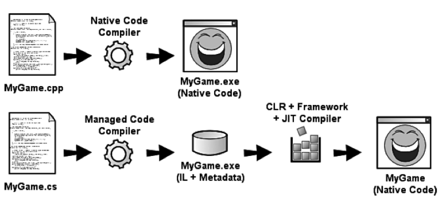
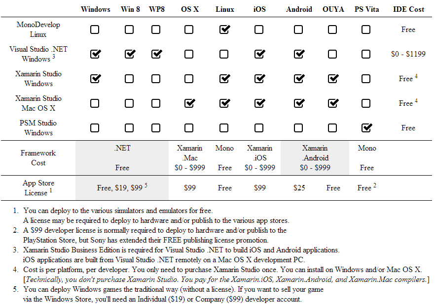

```
TODO:

- "// TODO: Add more text here."
```

## Overview

This chapter provides a good overview of the technologies upon which MonoGame is based. MonoGame, Xamarin Studio, Visual Studio, DirectX, OpenGL, Mono, and the .NET Common Language Runtime (CLR) are introduced, and each component’s role in the game development process is described, along with its history.

## What is MonoGame?

MonoGame is an open source implementation of the Microsoft XNA 4.x API that can be used to create cross-platform games (or to easily port existing XNA-based Windows, Windows Phone, and Xbox 360 games to other platforms) using the C# language.

Under the covers, MonoGame is powered by OpenTK (a C# library that wraps OpenGL, OpenCL, and OpenAL), SharpDX (a C#-compatible wrapper to the DirectX APIs), and Lidgren.Network (a C#-compatible networking API). These technologies are what enable MonoGame to support so many disparate platforms.

## What is XNA?

In 2005, Microsoft released a line of products for hobbyists, students, and novice computer programmers, distributed under the “Visual Studio Express” moniker. Since their initial release, Microsoft has continued to provide updates to the Express line of development tools as their commercial counterparts (the industry-standard IDEs for Windows development) are released.

These free tools allow the average home user to explore and experiment with software development without having to invest a lot of (or in most cases, any) money. You can develop utilities, desktop applications, websites, relational databases, and more using tools that have traditionally retailed for hundreds of dollars.

In the summer of 2006, Microsoft released another Express tool, targeting aspiring hobbyist and student game developers. That new tool was called XNA Game Studio Express. XNA provided a suite of tools and APIs that combined the power of DirectX with the ease-of-use of the .NET Framework, all accessed via managed code, using the C# programming language. Popular among hobbyists, enthusiasts, and independent game development studios, XNA was actively developed by Microsoft through four major versions.

## Why Not Just Use XNA?

The main reason to favor MonoGame over XNA is that XNA only runs on Microsoft platforms. MonoGame supports those same platforms, plus a slew of others.

But, even if you wanted to stick with XNA, you'd be a little crazy to do so. Microsoft mothballed the XNA project in 2014. XNA Game Studio 4.0 Refresh (released in late 2011) is the last version of XNA that will ever see the light of day. This was revealed in an internal Microsoft email, leaked in early 2013.

>"Presently the XNA Game Studio is not in active development ... further value and engagement cannot be offered to the MVP community. As a result, effective April 1, 2014 XNA ... will be fully retired from the MVP Award Program."

Gamasutra.com and Polygon.com, both referencing an article from ComputerAndVideoGames.com entitled, "Microsoft 'to axe XNA'," soon offered a more official announcement of XNA’s demise that contained the following information.

>A spokesperson for Microsoft at the PR firm Waggener Edstrom has insisted that... [Microsoft’s] move away from XNA will not affect games built with the development framework.
>
>"DirectX is the world's leading low-level interface for gaming and graphics. Microsoft is actively investing in DirectX as the unified graphics foundation for all of our platforms, including Windows, Xbox 360, and Windows Phone. DirectX is evolving and will continue to evolve. We have absolutely no intention of stopping innovation with DirectX."
>
>"XNA Game Studio remains a supported toolset for developing games for Xbox 360, Windows and Windows Phone. There are hundreds of XNA games available on Windows Phone and thousands of XNA titles available on Xbox 360. Games built with XNA run without changes on Windows 8 and Windows Phone 8."

Microsoft is pushing DirectX as the unified graphics solution for all their platforms. That means that future games will need to be developed in native languages that target DirectX directly, or managed code that targets some 3rd-party abstraction to DirectX.

## A Brief History of DirectX and XNA

When Windows first entered the PC consumer market, it addressed several very real needs. Before Windows, programs monopolized a PC’s resources. To run one application, you had to close another. Application developers had to write special-case code to support a wide variety of video cards, audio cards, and peripherals for all but the most basic of programs.

Windows provided a unified platform that application developers could target. This new platform provided (cooperative, at first) multi-tasking services and memory management services so that several applications could run simultaneously. This new platform also provided hardware abstractions that allowed application developers to target a single set of APIs for devices like printers, video cards, and audio cards.

For standard applications like spreadsheets and word processors, these abstractions were a godsend. They allowed the application developer to focus on the functionality of his application rather than the low-level inner-workings of the various hardware devices that were installed in his users’ PCs.

For game developers, however, these abstractions resulted in unacceptably slow interactions with the hardware. Most games in the early days of Windows required users to completely exit Windows and start the game from the command line.

Microsoft’s first attempt to address the performance needs of game developers was WinG, the predecessor of the DirectX APIs that we know today. DirectX provides a set of APIs, separate from the standard Windows APIs, to access hardware devices. These APIs, and their underlying device drivers, are highly optimized for performance.

While DirectX provides game developers with a means to write high-performance games that run within the Windows environment, it’s not the easiest API in the world to master. A veteran game developer can do amazing things with DirectX, but it can be a little intimidating to folks who are new to game programming. XNA masked that complexity, allowing game developers to focus on their game’s content and game play.

## What Is Managed Code?

On most development platforms, source code is compiled directly to native binaries that can be loaded and executed on the target processor (CPU) with no supporting runtimes or libraries. The executable file that’s created for these platforms contains the actual instructions for the targeted processor. For managed code, your source is compiled to an intermediate language (IL). This IL represents the instructions of a virtual, platform-agnostic CPU. This virtual CPU doesn’t actually exist anywhere but in software.

To run managed code on an actual CPU, there needs to be some intermediary between the managed executable and the physical processor. This intermediary, known as the runtime, is a program that was compiled to the target processor’s native instructions. The runtime then acts as a virtual CPU, emulating the non-existent, virtual CPU on the physical CPU.

<br/>
_**Comparison of Native and Managed Executable Files**_

### Just-in-Time Compilation

Emulating virtual CPU instructions sounds inefficient, doesn’t it? Actually for most applications, you would likely see only nominally lower performance over the same basic native code. But most managed code runtimes (Microsoft’s included) support a feature known as just-in-time compilation (JIT). The JIT compiler takes the intermediate language that was generated by the managed compiler and generates native code that’s optimized for the targeted physical CPU just before the code is actually executed on the physical CPU. While there is still some overhead imposed by having the runtime layer between your application and the physical CPU, JIT compilation closes the overall performance gap between your managed code and it’s native cousins.

That sounds interesting, but why include the additional complexity? What does targeting managed code offer an application developer that they wouldn’t normally have when writing native code?

### Garbage Collection

A major benefit comes in the area of memory management. In traditional languages that compile to native executable files, memory leaks are a common problem. It’s easy for developers to forget to release system resources that they allocate, especially when complex code paths or exception handling are involved.

In managed code, like native code, memory is allocated as it’s needed. Unlike native code, the managed runtime keeps track of these allocations and any references to them. When the resource is no longer referenced by any of the live objects in your application, it’s automatically released by the runtime. There are still a few special cases where leaks can occur (especially when dealing with unmanaged resources from your managed code), but memory management basically comes for free in a managed environment. This feature of managed runtimes is known as garbage collection (GC).

### Write Once, Run Everywhere

Another benefit of managed code is platform agnosticism. Since your code targets a virtual CPU, it has no direct ties to the physical CPU on which it runs. That means that your managed code should be able to run on any platform that provides a runtime for it. For instance, (in theory) an application written in managed code could run on PCs, handheld devices, mainframes, or even game consoles.

Having code that can execute on any platform is neat, but without access to components beyond the CPU, your code won’t be able to do anything useful. In addition to the runtime, managed environments also include a set of APIs that allow you to access the native OS features via abstractions that won’t tie you to a specific platform. These APIs include classes that: allow you to access the file system to read and write files, utilize the user interface components of the operating system (like buttons, checkboxes, and menus), control peripherals (like printers), and access media components (like the sound system and screen).

## What Is the Role of MonoGame?

Accessing the native host components through an abstraction layer is generally slower than accessing those same resources natively. In the case of the printer or file system, the performance difference isn’t very noticeable. The device itself is slower than the abstractions—your code spends much of its time waiting for the device to complete issued commands.

In the case of components like the graphics system, however, the cost of abstraction is much greater. Updating millions of pixels every second requires a lot of CPU power, even when using native code. Thanks to advances in graphics hardware, a lot of that graphics processing can be offloaded to the graphics card itself by way of specialized programs that run on a secondary CPU that’s embedded on the graphics card known as the graphics processing unit (GPU). By running these specialized routines on the GPU, your application is only responsible for coordinating the efforts of the GPU and for shuffling required data to and from graphic memory.

The MonoGame Framework includes a set of managed libraries that provides access to these advanced hardware features using OpenGL or DirectX. DirectX is a technology that is tied to Microsoft platforms such as Windows, Windows Phone, Zune, and Xbox game console, OpenGL provides the same abstractions to graphics hardware, in a cross-platform API (which happens to include support for the various flavors of Windows). As with DirectX, OpenGL provides APIs and underlying device drivers that are highly optimized for performance.

In addition to the graphics hardware, the MonoGame Framework supports input devices and audio via managed wrappers to the underlying native APIs.

The .NET Framework is fast becoming the leading platform for developing general-purpose Windows applications that run on the desktop, the web, and mobile devices. The MonoGame Framework relies on .NET Framework components like the Common Language Runtime and the core class libraries, but the MonoGame Framework has been specifically designed and optimized (based on XNA 4.x APIs) for developing games.

When you’re accessing the file system, managing threads, or dealing with collections of data, you’re using the .NET Framework. When you’re playing music, rendering 3D objects, or displaying a heads up display in your game, you’re using the MonoGame Framework. These two frameworks complement each other, greatly simplifying the Herculean effort of writing great games.

While you will still need to build separate packages for each targeted platform, MonoGame makes it possible to write code that is portable across a variety of devices and operating systems, with little or no modification.

## What is Xamarin?

Mono is an open source implementation of Microsoft’s .NET Framework, based on the ECMA standards for the C# language and the Common Language Runtime (CLR). Mono enables the creation of applications on platforms such as Linux and Mac OS X using .NET technologies.

Xamarin is a company that sponsors Mono development, and is heavily invested in the future of Mono as an emerging technology. Xamarin offers a suite of tools and APIs that make it possible to write applications for Apple’s iOS devices and Google’s Android devices using the C# language. Platform-specific, native APIs are exposed as .NET bindings to your code that runs on the CLR implementations for iOS and Android that Xamarin created.

You can develop mobile applications using Xamarin’s own, full-featured IDE, Xamarin Studio, or you can leverage your experience in Microsoft’s Visual Studio to create, build, debug, and deploy your applications using the industry standard IDE for .NET development. I make my living writing Windows applications in Visual Studio. When I’m off the clock, though, I’m a Mac guy. On my MacBook Pro, I’m a big fan of Xamarin Studio for OS X, Android, and iOS development.

> Update: Xamarin was officially acquired by Microsoft in 2016. The same tools described in this text are still available, but they have a new home.

## What Role Does Managed Code Play in Games Today?

As a standard for Windows application development, C# is often used as the language of choice for writing the tools that support game development. And C# has been used to write some really great Windows games. But for performance-critical applications, game developers typically use languages that target native code, like C and C++. Before the introduction of the XNA Framework, C# wasn’t really the best option for developing high-performance games like first-person shooters or 3D racing games.

### Scripting and AI

While C# is a relative newcomer to the area of game development, managed code has been used to script game objects and AI for a while now. Many times, developers will embed script parsers for game logic, and use native code only for those areas of code where performance is critical.

Native game code is the domain of the expert programmer. Using scriptable objects makes it easier to have level designers implement basic object interactions and frees up the more experienced developers to handle the tricky, more technical areas of the code. As an added benefit, having your designers implement object interactions eliminates the communication barriers between the designers and the developers who often seem to speak different languages.

Of course, there’s a time investment in getting the designers started and in supporting them in their efforts; but typically, developers find that the designers are able to use the scripting engines in ways that they never envisioned, leading to incredibly creative and innovative level designs. And since the designers don’t need to rely on the developers to make changes to the code whenever they want to tweak their designs, the overall turnaround time is reduced, and the designers can try many more variations on their themes than would typically be possible in an often-too-tight product development cycle.

### Easier Code, Easier Maintenance

The MonoGame Framework makes it easier for individuals and small teams to reap the benefits of reduced development times and lower levels of complexity typically seen when using a scripting engine, while also gaining the performance benefits of native (JIT’ed) code that targets the OpenGL APIs.

Now you don’t need to be a veteran game developer to write great, commercially viable games. Of course, those veterans will be able to make the MonoGame Framework do things that a novice can only dream of, but in the realm of traditional native code, most entry-level developers would have a heck of a time just trying to get their game project off the ground.

## What Platforms Does MonoGame Support?

// TODO: Add more text here.


_**Development Platforms**_

// TODO: Add more text here.

{pagebreak}

## Summary

MonoGame and Xamarin technologies make game development easier and more approachable for novice, hobbyist, and student developers by providing out-of-the-box support for many of the most common game programming tasks. By using MonoGame and managed code, your ideas will move from doodles on a napkin to playable games on your PC or mobile devices faster than ever before. Your code will be more robust and resistant to crashes. And you’ll be able to do all of this without emptying your wallet.

In this chapter, you learned what MonoGame is and how it can help you to write games for a variety of platforms. You also learned what managed code is and how it can make life easier for game developers. In the next chapter, we will get these tools installed and prepare your development environment so that you can start bringing your game ideas to life.

## Review Questions

Think about what you’ve read in this chapter to answer the following questions.

1.	What are two benefits of writing applications in managed languages like C#? 
1.	Can I develop commercial games using MonoGame? 
1.	What is DirectX? How does DirectX help me to write video games? 
1.	What is OpenGL? How does OpenGL help me to write video games? 
1.	What is the role of the MonoGame Framework with respect to OpenGL and DirectX?

## Exercises

**EXERCISE 1.** Write down a game idea that you have. Try to be specific in your description of the game play. Where does the action take place? What entities and objects exist in your game world? How to they interact with each other. Don’t focus on the technical aspects; just document your idea from a game player’s perspective. As you progress through the book, consider how what you learn can be used to implement your idea. Revisit your notes frequently, revising them as you go. When you feel comfortable with the tools and technologies that you’re reading about, start fleshing out your design, and start writing a prototype —a playable, "proof of concept" of your game idea.

**EXERCISE 2.** Pick a game that you enjoy playing. As you progress through the book, start thinking about how that game was designed and written. How would you write it? When you’ve reached the end of the book, try to write a simple clone of this game. Don’t focus on the overall game. Try to break it down into smaller, more manageable components that you feel comfortable writing. Then put those components together to create the more complex whole. Don’t worry about making a commercial-quality game. Just try to capture the essence of what makes the game enjoyable.
