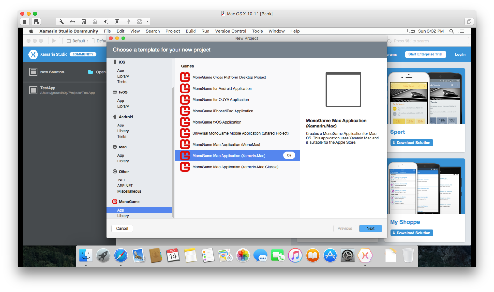
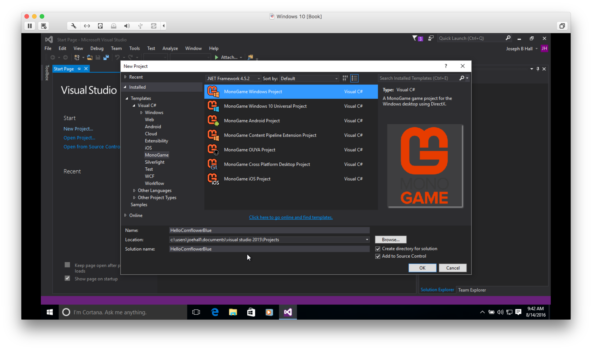
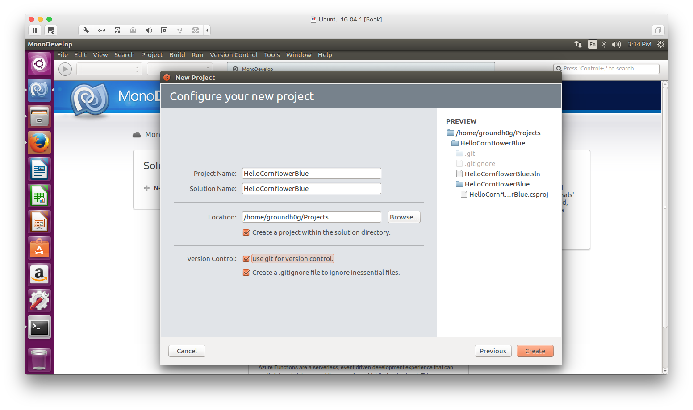

```
TODO:

- "including the version of the MonoGame framework that was used to build it"?
- "I fully intended to document the steps for creating an empty project for each platform."
```

## Overview

This book is based on my work with high school students at the annual, week-long game programming camp in North Carolina. In that class, we spend the first day installing the tools that we'll use, and we brainstorm game ideas on the whiteboard. Most of the students have no prior experience with programming, but by the end of the week, we have a fully functional game.

This book follows that model. As such, this chapter is day one. It's time to get your development machine configured so we can build new worlds!

> In this chapter we will:
> 
> - Configure our development environment
> - Create a do-nothing game to test our tools
> - Learn how to conditionally handle various platforms

## Supported Development Environments

When it comes to development environments, Windows and Mac OS X are represented well by Visual Studio and Xamarin Studio, respectively. Linux is also supported, using the MonoDevelop IDE.

The source code for the examples from this book will be provided for both Windows and Mac OS X. The core code of the examples (99+%) should be identical on both platforms -- the solution files and content project *may* require minor tweaks. After the dust settles down, I intend to also provide projects that have been tested and verified to work on a Linux development machine (Ubuntu, most likely). 

While it's **certainly** not the focus of this text, I also hope to provide an example of integrating the Xamarin, Visual Studio, and MonoGame techs into a continuous integration (CI) build pipeline. Don't expect to be an expert in CI or TDD after reading this book, though. It's more a cursory interest of mine that I intend to share with my readers.

## Supported Target Platforms

The whole point of MonoGame is to provide a single framework that runs on as many devices as possible. That list is large, and it will continue to grow.

To keep things simple in this book, I've decided to limit the discussions to running games on the three development platforms - Windows, Mac OS X, and Linux. The rationale was simple. You're already using your development machine to write your game, and you'll need to run and debug on that platform anyway.

Time permitting, I'll add one or more chapters at the end of the book to cover the specific issues you'll need to account for when targeting the other platforms. At a minimum, all of the examples should have buildable and runnable projects that you can download for all the platforms that I'm able to support.

> The phrase, "that I'm able to support", sounds suspicious. What do I mean by that? Well, it basically means two things:
> 
> 1. The MonoGame implementation for the target platform is stable enough to support my example game.
> 1. The example makes sense on the platform -- e.g. you're probably not using a touchscreen and accelerometer with your Ouya, and you're not likely to use a mouse with an iPhone.

## Supported IDEs

I know that the MonoGame build process supports a Visual-Studio-driven workflow for Xamarin build tools (for example using Visual Studio to kick off Xamarin tools on a Mac to build and debug iOS apps from Windows), but I want to keep the scope of this volume narrow. I'm assuming that you're using Xamarin Studio on a Mac or Visual Studio on Windows as your primary development environment.

Honestly, though. Once your development environment is configured (you know, by clicking Next, Next, Next, ... from the installer), the game code is **very** similar. It's just the application hooks that vary. And you really shouldn't have to worry about that if MonoGame is doing its job well.

For the Mac OS X and Linux platforms, I recommend that you run the latest version of the operating system. In fact, the primary development tool for OS X, XCode, won't install unless your computer is running the latest version of the operating system. Visual Studio generally supports older versions of Windows a little better, but it's still a good idea to use the latest version you have available.

> I really *hate* detailing the installation process in a book. Technology moves so fast that the steps described in this chapter may be obsoleted by the time you read them. For example, MonoDevelop may have a kick-butt template system where you can generate new MonoGame projects out of the box with just a few clicks. That's not the case today. So, I'll fight my instincts and document the steps that I took when creating the examples for the book - including the steps to prepare my development environments.

## A Note on Project Templates

I love project templates -- when they work, that is. But templates have a tendency to become outdated and broken. For XNA, the project templates were a part of the release. When each new version came out, there was a new "click here, here, and here" to create an empty project for the new version of the APIs. With MonoGame, the templates aren't a part of the release. They're maintained separately. That's why I've decided to provide you with handcrafted "empty" projects for each platform. Each contains all the components required to write your game. MonoGame may move on (and likely *will* have moved on) to a new version by the time you get around to writing your next *Cut the Rope* killer, but it won't matter. Everything that you need will be included in the project &mdash; including the version of the MonoGame framework that was used to build it.

After detailing the installation process for the tools, I'll describe the process of creating empty MonoGame projects for each platform (hooray for `Color.CornflowerBlue`) so that you know what's going on under the covers if you'd like. You can feel free to skip those details for now. They'll be here waiting for you if you need them later. In fact, I suggest that you do ignore the "Empty Project: {*Target Platform*}" sections for now. Come back after you have a few MonoGame projects under your belt. It should make more sense then.

>For the curious, my personal workflow is to build each example game in Xamarin Studio on my MacBook Pro. I then make sure the same example works in Windows, before moving on to the next. When all the examples have been written, I'll return to spackle the gaping holes in platform support.    
>  
>Along the way, I'll test the odd example on one of the other platforms (like Android, Ouya, or PS Vita - since they're free to deploy) just to make sure there aren't any systemic flaws in the organization of the example games.

{pagebreak}

## MonoGame for Mac OS X

While I've made my living as a Windows developer, my primary development machine these days is a MacBook Pro. I only bought that laptop so that I could write iOS apps, but I fell in love with the platform. If you intend to write games for OS X, iPhone, iPad, and iPod Touch, you'll eventually find your way to this section.

### Install the Tools

The core of the build system for OS X and iOS is XCode. So, we'll need to install it before we do anything else. Open the App Store on your Mac. Search for "XCode", then install it. This will take a while (the current version of XCode is nearly 4GB). Feel free to take that potty break now.

Once the monster has been installed, launch it so that we can get past the "first run" initialization tasks. Once it's open, close it. You can play around in there if you like, but I suggest leaving a trail of breadcrumbs so that you don't get lost.

Next, we will install Mono (the .NET runtime for non-Microsoft platforms). Head over to the Mono download page at `http://www.mono-project.com/download/`. Download the installer for Mac OS X. Once downloaded, launch the installer and accept the defaults.

Now we can install the IDE that we'll be using &mdash; Xamarin Studio. Head over to the Xamarin website at `https://www.xamarin.com/download`, fill out the form, and download Xamarin Studio Community. Once downloaded, open the disk image and double click the installer. Accept the defaults. This is another rather large install, so be prepared to wait a bit.

> If the installer fails for some reason, you'll be presented with the steps to manually install the components. You really shouldn't have to manually install anything. Just wait a little while and try again. There may have been an issue with one of the 3rd-party servers that the installer contacts for downloads.
> 
> I had the misfortune of having to run the installer several times. Thankfully, it's really smart about resuming where it left off, so each launch of the setup brought me closer and closer to my goal.

As with XCode, we'll want to launch Xamarin Studio so that we can get past the "first run" initialization tasks. Once it's open, close it. At this point, you have all the tools you need to write cross-platform apps using C#. But, we still haven't installed the tools that we'll use to write our games. So, let's do that now.

Head over to the `http://monogame.net/` website, then click on the **Downloads** link at the top of the page. At the time of this writing, the latest version is **MonoGame 3.5**. Clicking that link provides more links. Click the **MonoGame 3.5 for MacOS** link to download the `MonoGame.pkg` installer. When it's done downloading, launch it. Accept the defaults.

> OK. It's official. I'm cursed. This installer silently failed to add the templates to Xamarin Studio duing the setup. No biggie, though. I just went to the Add-in Manager to see if the MonoGame add-ins had been installed (**Xamarin Studio Community &raquo; Add-Ins...** from the main menu). It turns out that the MonoGame add-in needed to be updated. So, I clicked the **Updates** tab, selected the MonoGame add-in, and then clicked the **Update** button. Problem solved.

Fingers crossed. We may actually be done. It's now time to verify that things are working as expected.

### Verify the Installation

Open Finder, then click on the Applications tab to the left. Locate "Xamarin Studio". If you don't want to search for the application every time, drag the icon to your desktop or taskbar so it's more readily available. When you're done with the light housekeeping, click the icon to launch the IDE.

Click **File &raquo; New &raquo; Project...** in the menu. Select "MonoGame Mac Application (Xamarin.Mac)" from the "MonoGame / App" project types. Click **Next**. Check the 2 version control boxes (use git, create a `.gitignore` file), and then click **Create**. I named my project and solution "HelloCornflowerBlue", and I kept the default "Projects" folder to keep my games organized.

<br/>
_**Creating our first project**_

The IDE will churn a bit as it creates the project. When the dust settles down, click the play button at the top of the interface. If everything is working, you should see a window with a bright blue background.

Congratulations. You've created your first game on Mac OS X.


---


Once the downloads have completed, you'll want to install the MDK first, and then MonoDevelop.

When those steps are complete, you should have a fully functioning development environment. Both Xcode and MonoDevelop (Xamarin Studio) should appear in both the OS X Launchpad and in the Applications folder.

### Verify the Installation

Go ahead and launch Xamarin Studio. Unless you change the default behavior in the settings, every time Xamarin Studio runs, it will check for updates. Chances are pretty good that there will be an update available the first time you open the application. So, give it a few minutes before you move on.

We begin by creating a new MonoMac project. Create a new solution by selecting *File / New / Solution* from the menu. The "New Solution" dialog will open. Expand the "Unsupported" option in the left pane. Select "MonoMac (OpenSource)", and then select the "MonoMac Project" in the middle pane. Let's name our new solution "MyFirstApp". Click the OK button. In a few short seconds, you'll have a shiny, new MonoMac application project.

Click the Play icon at the top, left of the IDE or select *Run / Start Debugging* from the menu. You'll be rewarded with an empty gray window. Congratulations. You've just written your first MonoMac application.

{pagebreak}

## MonoGame for Windows

For Windows, we'll use Visual Studio to create our games. This is by far the easiest of the three development environments to configure.

### Install the Tools

Since the location of the download has changed a lot over the years, I tend to search for "Microsoft Visual Studio download" in my favorite search engine, skip the ads at the top of the results, and click the first valid link.

Today, that link takes you to `VisualStudio.com`. Make your way to the **Downloads** page, and then click the link to download the Visual Studio Community installer.

Run the installer. Accept the defaults. Wait. (Now's a good time to get that cup of coffee you've been hankering for.) Once Visual Studio has been installed, launch it. We'll want to get all those "first run" initialization tasks out of the way.

After you've installed and run Visual Studio, exit it without doing anything. Of course, you can play around in there if you like, but we're ready to install the bits for game development now.

Head over to the `http://monogame.net/` website, then click on the **Downloads** link at the top of the page. At the time of this writing, the latest version is **MonoGame 3.5**. Clicking that link provides more links. Click the **MonoGame 3.5 for VisualStudio** link to download the `MonoGameSetup.exe`. When it's done downloading, launch the installer. Accept the defaults.

Fingers crossed. We may actually be done. It's now time to verify that things are working as expected.

### Verify the Installation

Click the Start button, find "Visual Studio". If you don't want to search for the application every time, right click the icon and select "Pin to Start" or "Pin to taskbar" so it's more readily available. When you're done with the light housekeeping, click the icon to launch the IDE.

Click **File &raquo; New &raquo; Project...** in the menu. Select "MonoGame Windows Project" from the "MonoGame" project types (under **Installed / Templates / Visual C# / MonoGame**). Check the "Add to Source Control" box, and then click **OK**. I named my project and solution "HelloCornflowerBlue", and I kept the default "Projects" folder to keep my games organized.

<br/>
_**Creating our first project**_

The IDE will churn a bit as it creates the project. When the dust settles down, click the **Start** button (with the green play icon) at the top of the interface. If everything is working, you should see a window with a bright blue background.

Congratulations. You've created your first game on Windows.

{pagebreak}

## MonoGame for Linux

Another platform. Another suite of development tools. We need to visit the MonoGame website to download the installer for Linux. I suggest that you follow the instructions listed there, it's more likely to be current. If you'd rather have the step-by-step, though, read on.

> I'm using Ubuntu 16.04 as I write this text. It looks like OpenSUSE makes things easier with (multiple) one-click installs, but I haven't tested anything other than Ubuntu.
> 
> The basic flow is to:
> 
> 1. Install Mono
> 2. Install MonoDevelop
> 3. Install MonoGame Dependencies
> 4. Install MonoGame

### Install the Tools

Run the following commands within a terminal window to install Mono (the .NET runtime for non-Microsoft platforms). There are some extras that these commands install that you may or may not need, but it's better to grab them all now so that you don't waste time troubleshooting issues down the road.

```
sudo apt-key adv \
   --keyserver hkp://keyserver.ubuntu.com:80 \
   --recv-keys 3FA7E0328081BFF6A14DA29AA6A19B38D3D831EF

echo "deb http://download.mono-project.com/repo/debian wheezy main" | \
   sudo tee /etc/apt/sources.list.d/mono-xamarin.list

sudo apt-get update

sudo apt-get install \
   mono-devel \
   mono-complete \
   referenceassemblies-pcl \
   ca-certificates-mono \
   mono-xsp4
```

Next, we need to install the IDE &mdash; MonoDevelop. Again, I've opted to include more than you'll need. And, again, it's so that you don't have to bang your head against the keyboard later.

```
sudo apt-get install \
   monodevelop \
   monodevelop-nunit \
   monodevelop-versioncontrol \
   monodevelop-database
```

OK. We're almost there. We have the .NET runtime and the IDE, but we still need the tools to build games. It's time to install MonoGame. Before we actually install MonoGame, though, there are a few prerequisites. Use the following commands to get the dependencies installed.

You will be prompted to accept the EULA for the TTF fonts. Use the tab and enter keys to navigate the prompts.

```
sudo apt-get install \
   libopenal-dev \
   gtk-sharp3 \
   referenceassemblies-pcl \
   ttf-mscorefonts-installer
```

The last step in this somewhat convoluted process is to install MonoGame, itself. For that, we'll need to hit the web to download a script that will take care of the remaining bits for us.

Head over to the `http://monogame.net/` website, then click on the **Downloads** link at the top of the page. At the time of this writing, the latest version is **MonoGame 3.5**. Clicking that link provides more links. Click the **MonoGame 3.5 for Linux** link to download the `monogame-sdk.run` script.

Assuming defaults, your file should be in the `~/Downloads` directory. Go back to the terminal window, `cd` into that folder, and issue the following commands.

```
sudo chmod +x ./monogame-sdk.run
sudo ./monogame-sdk.run
```

You will be prompted to confirm that the dependencies have been installed. They have. We did that in the previous steps. So answer "Y" when promted.

You will be prompted to install the monodevelop addin. Again, answer "Y" when prompted.

> If you're lucky, you won't see any errors during this process. I'm not so lucky. There were a dozen or so "ERROR" messages, each fussing about ASP.NET. That's not important to us for writing games, but you may want to do a little googling if you're planning to use MonoDevelop for more than just game programming.

Fingers crossed. We may actually be done. It's now time to verify that things are working as expected.

### Verify the Installation

Using the search button on the Ubuntu taskbar, find "MonoDevelop". If you don't want to search for the application every time, drag the icon over to the taskbar so it's more readily available. When you're done with the light housekeeping, click the icon to launch the IDE.

Click **File &raquo; New &raquo; Solution...** in the menu. Select "App" from the "MonoGame" project types, and then click **Next**. I named my project and solution "HelloCornflowerBlue", and I created a "Projects" folder to keep my games organized.

Check the two boxes for version control (use git, create a ".gitignore" file), and then click **Create**.

<br/>
_**Creating our first solution**_

The IDE will churn a bit as it creates the project. When the dust settles down, click the play button at the top of the interface. If everything is working, you should see a window with a bright blue background.

Congratulations. You've created your first game on Linux.

{pagebreak}

## Empty Projects

The team of developers that maintains the MonoGame project has created a new repository for sample games. Their goals were set forth in a post to the MonoGame blog from Simon Jackson on April 17, 2014.

>... [T]he core MonoGame team set out with a purpose to being a new samples repository for the project. Its goals were simple:
   
>The samples had to be of high quality. They had to work on ALL platforms not just one. Best practices had to be used where possible. They had to be testable and re-usable to test the latest builds (builds may not pass if samples tests failed) ...
   
So, that sounds like a good place to start. When Simon posted the news item on the MonoGame website, there was a whopping one sample game -- `Platformer2D`. But one is all we need. The samples repository can be accessed from the following URL.

```
   https://github.com/Mono-Game/MonoGame.Samples
```

## Copy-and-Paste #1: Main.cs

We'll be using the "Main.cs" from that example game for all our empty projects. It provides the launching point for all platforms using conditional compiler directives.

    using System;
    #if MONOMAC
    using MonoMac.AppKit;
    using MonoMac.Foundation;
    #elif IPHONE
    using MonoTouch.Foundation;
    using MonoTouch.UIKit;
    #endif

    namespace MyFirstGame
    {
      #if MONOMAC
      class Program
      {
         static void Main (string[] args)
         {
            NSApplication.Init ();
    
            using (var p = new NSAutoreleasePool ()) {
               NSApplication.SharedApplication.Delegate = new AppDelegate ();
               NSApplication.Main (args);
            }
         }
      }
    
      public partial class AppDelegate : NSApplicationDelegate
      {
         private MyFirstGame game;
    
         public override void 
         FinishedLaunching (MonoMac.Foundation.NSObject notification)
         {
            game = new MyFirstGame();
            game.Run();
         }
    
         public override bool 
         ApplicationShouldTerminateAfterLastWindowClosed (NSApplication sender)
         {
            return true;
         }
      }
      #elif IPHONE
      [Register ("AppDelegate")]
      class Program : UIApplicationDelegate 
      {
         private MyFirstGame game;
    
         public override void FinishedLaunching (UIApplication app)
         {
            game = new MyFirstGame ();
            game.Run();
         }
    
         static void Main (string [] args)
         {
            UIApplication.Main (args,null,"AppDelegate");
         }
      }
      #else
      #if !WINDOWS_PHONE
      /// <summary>
      /// The main class.
      /// </summary>
      public static class Program
      {
         static void Main()
         {
         #if WINDOWS || LINUX || PSM
            using (var game = new MyFirstGame ())
            game.Run();
         #else
            var factory = 
               new MonoGame.Framework.
               GameFrameworkViewSource< MyFirstGame >();
            Windows.ApplicationModel.Core.CoreApplication.Run(factory);
         #endif
         }
      }
      #endif
      #endif
    }

You can search and replace "`MyFirstGame`" with whatever your new project name is.

## Copy-and-Paste #2: Game.cs

We'll use the following Game.cs for all our empty game projects. I resisted the urge to include a simple implementation for `LoadContent`, `Update`, and `Draw`. I think that a blank, blue screen isn't very impressive, but it's the perfect canvas from which to start your own projects.


    using System;
    using System.Collections.Generic;
    using Microsoft.Xna.Framework;
    using Microsoft.Xna.Framework.Graphics;
    using Microsoft.Xna.Framework.Input;
    using Microsoft.Xna.Framework.Media;
    using Microsoft.Xna.Framework.Input.Touch;
    
    namespace MyFirstGame
    {
      public class MyFirstGame : Microsoft.Xna.Framework.Game
      {
         // Resources for drawing.
         private GraphicsDeviceManager graphics;
         private SpriteBatch spriteBatch;
    
         public MyFirstGame ()
         {
            graphics = new GraphicsDeviceManager(this);
            Content.RootDirectory = "Content";
    
            #if WINDOWS_PHONE
            TargetElapsedTime = TimeSpan.FromTicks(333333);
            #endif
    
            //graphics.IsFullScreen = true;
            //this.IsMouseVisible = false;
    
            graphics.PreferredBackBufferWidth = 800;
            graphics.PreferredBackBufferHeight = 480;
    
            graphics.SupportedOrientations = 
               DisplayOrientation.LandscapeLeft | 
               DisplayOrientation.LandscapeRight;
         }
    
         protected override void LoadContent()
         {
            // Create a new SpriteBatch, which can be used to draw textures.
            spriteBatch = new SpriteBatch(GraphicsDevice);
    
            // TODO: Load content
         }
    
         protected override void Update(GameTime gameTime) 
         {
            // TODO: Update world
    
            base.Update (gameTime);
         }
    
         protected override void Draw(GameTime gameTime)
         {
            graphics.GraphicsDevice.Clear (Color.CornflowerBlue);
    
            // TODO: Draw world
    
            base.Draw (gameTime);
         }
      }
    }

You can search and replace "`MyFirstGame`" with whatever your new project name is.

## Empty Projects (About-Face)

I fully intended to document the steps for creating an empty project for each platform. But, once I got waste deep into the first platform, I realized how tedious and error-prone the process is. I'm going to provide empty projects for each platform on my website. If there's enough demand, I'll document the steps for one or two of the platforms as one or more blog posts.

In a nutshell, each platform is conceptually the same. You create an empty project, add in the cut-and-paste code snippets listed earlier (into Main.cs and Game.cs, creating them if they don't exist), and then set some project properties.

I've written some helper classes to handle most of the platform voodoo, but they're not referenced in the above snippets for the sake of keeping the code pure (pure MonoGame, that is).

Compiler directives that I pulled straight from the MonoGame Framework projects drive the "voodoo". I'll list them here for your convenience. Note that they are subject to change. So, you should check the latest values in the MonoGame repository if you're having platform-specific issues.

|Platform    |Constants|
|------------|------------|
|Android     | ```TRACE; ANDROID; GLES; OPENGL;```|
|Linux       | ```LINUX; OPENGL;```|
|MacOS       | ```MONOMAC; OPENGL;```|
|Ouya        | ```TRACE; ANDROID; GLES; OPENGL; OUYA;```|
|PSMobile    | ```DEBUG; PSM;```|
|Windows     | ```DEBUG; TRACE; WINDOWS; DIRECTX; WINDOWS_MEDIA_SESSION;```|
|Windows8    | ```TRACE; NETFX_CORE; WINRT; WINDOWS_STOREAPP; DIRECTX; DIRECTX11_1; WINDOWS_MEDIA_ENGINE;```|
|WindowsGL   | ```TRACE; WINDOWS; OPENGL;```|
|WindowsPhone| ```TRACE; DEBUG; SILVERLIGHT; WINDOWS_PHONE; WINRT; DIRECTX;```|
|iOS         | ```IOS; GLES; OPENGL;```|


If you use my helper class, `PlatformHelper`, you shouldn't need to reference those via compiler directives, but they will need to be set in your game's project options.

Using the helper, you can write code like the following.

    if(PlatformHelper.CurrentPlatform == Platforms.WindowsPhone) 
    {
      TargetElapsedTime = TimeSpan.FromTicks(333333);
    }
    
    graphics.IsFullScreen = PlatformHelper.IsMobile;
    this.IsMouseVisible = PlatformHelper.IsDesktop;

Without the helper, the conditional logic gets messy. For example, the property, `PlatformHelper.IsMobile`, knows that Ouya is not a mobile device, even though the `ANDROID` compiler directive is set.

There's nothing special about the code that performs the various checks for you. You need not use my classes if you don't want to. They're just provided as a convenience.

{pagebreak}

## Summary

Blah. Blah. Blah.

## Review Questions

Blah. Blah. Blah.

## Exercises

Blah. Blah. Blah.
