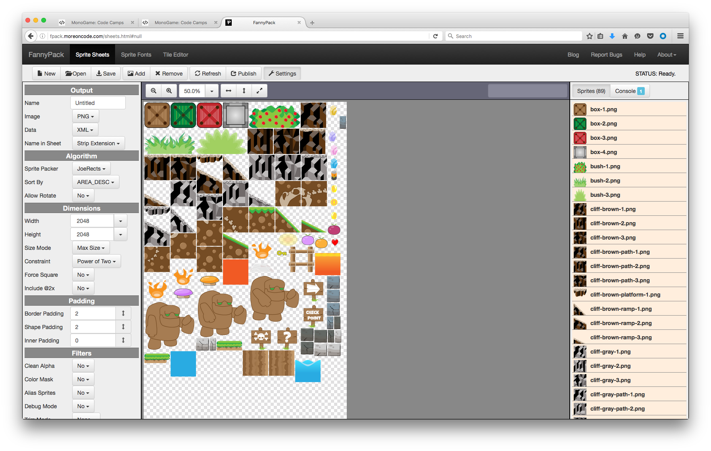
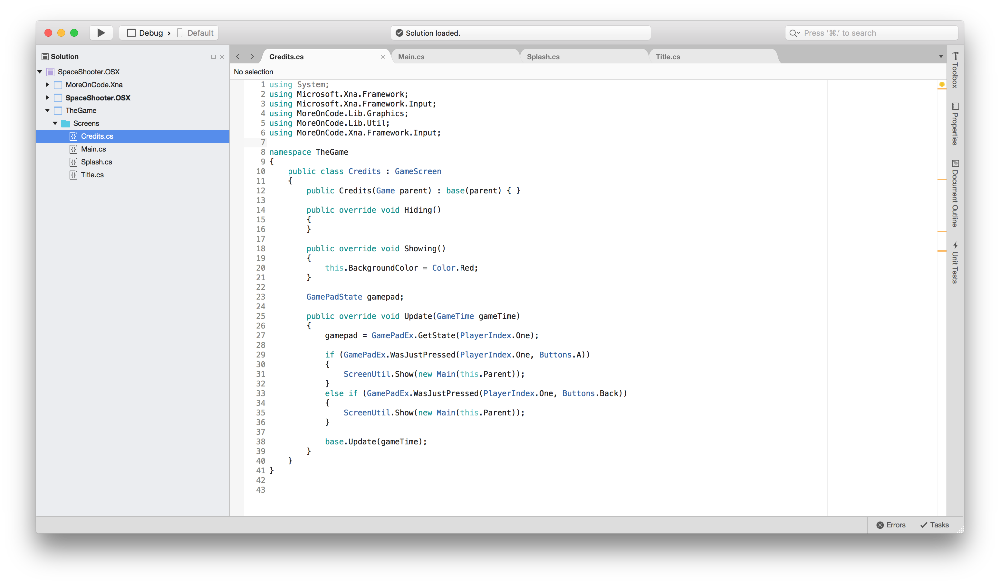

## Overview

We built a playable game in the previous chapter, but it's not exactly store-worthy. I'm not saying that it ever will be, but there are some obvious changes that we can make to give the game a more professional feel. 

Building on the game from the last chapter, we'll add music, sound effects, visual effects, and multiple screen types. We'll also introduce the concepts of sprite sheets and basic particles. Stitching sprite sheets by hand is inefficient and prone to error. This chapter walks you through using FannyPack, an open-source suite of game development tools by yours truly, to create sprite sheets and bitmap fonts for your games.

After you complete this chapter, you'll be able to jump to any of the chapters that follow which capture your interest.

> In this chapter we will:
> 
> - Add multiple screen types to our game
> - Learn how to build and use sprite sheets
> - Learn how to draw text in our game
> - Learn how to incorporate particles
> - Add some polish and fluff 

## Planned Game Enhancements

Lorem ipsum dolor sit amet, consectetur adipiscing elit. Mauris sit amet fringilla augue. Integer justo lectus, fringilla sed tempus quis, accumsan ut mi. Duis ipsum quam, sodales ac fringilla at, gravida finibus ante. Fusce facilisis tellus et ultricies volutpat. Mauris eget tincidunt nulla. Vestibulum sodales nibh ipsum, nec euismod erat maximus id. Praesent posuere ultrices ultricies. Fusce bibendum vulputate mauris eu ultricies. Donec id laoreet ante, vel imperdiet dolor. Morbi suscipit lectus sit amet euismod imperdiet.

Nullam vulputate ipsum id maximus vulputate. Nullam tempor accumsan odio, ac accumsan tellus ultricies at. Nunc ex justo, egestas nec condimentum id, lobortis condimentum urna. Suspendisse potenti. Donec scelerisque leo quis felis facilisis bibendum. Etiam augue quam, varius nec enim dictum, imperdiet semper ex. Donec feugiat consectetur nulla, quis eleifend mauris vehicula ac. Duis pretium ac lacus vel gravida. Donec facilisis vestibulum venenatis. Donec odio arcu, rhoncus at semper vel, iaculis eu sapien.

Before we get too deep in the weeds, let's take a look at some common game development practices that will make our lives a bit easier.

## FannyPack

Fanny Pack is a suite of tools that I developed for my game programming students. There are certainly better products out there, but I wanted my students to have access to free tools and, more importantly, access to the source code for those tools. I also didn’t want the tools to look like poop that was designed in the 80’s.

You can use FannyPack right now, without installing anything. It's a browser-based application that runs on your local PC. The technology that drives Fanny Pack is vanilla HTML5 and JavaScript. That means that you can use the app from any operating system, using any modern web browser. You don't have to be an administrator on your computer and you don't have to worry about software updates.

> At least, that's the idea. I've been developing on my MacBook Pro, using Google's Chrome web browser. I'll be doing more extensive testing as the project evolves.

There is no server component to FannyPack. Assets are loaded into your browser from your local file system. Project files are loaded from and saved to your computer. Published resources are generated on and saved to your computer. Your data is never transmitted to the server. I don't need to see it, and I don't need to pay for dedicated servers that churn through data or bandwidth for that data to travel to and from those servers.

You can kick the tires now, or after you've read a bit more about the tools in FannyPack. The URL is `http://fpack.moreoncode.com/`.

### Sprite Sheets

In our first game, each object in the world was represented by a separate image. The player, the enemies, the score, the health meter, the start prompt, ... everything. That's fine for a simple game like ours, but it's inefficient to manage and render separate resources. Every time we send a new image to the graphics card during a render, a cost is incurred.

The sprite is sent to the graphics card from your computer's memory to the memory on the GPU. If you're rendering the same image multiple times, the framework is smart enough to send the image only once (the first time). If you keep switching sprites, the new image data has to travel from your computer to the graphics card. It happens very quickly, but when multiplied by a large number of on-screen images, the effects start to add up.

In the case of dozens of objects, the cumulative effect is insignificant. As our games grow in complexity, though, we'll be managing hundreds, thousands, or even tens of thousands of instances of our sprite assets. It's time for a better approach. That's where sprite sheets come in.

A sprite sheet is a single image that contains all of the sprite images in one, larger asset. When you render a sprite from the sheet, you render a small section of the image - the rectangle which contains the sprite you want to draw. It makes the rendering logic a little more complicated, but it eliminates the chatter of continually swapping separate sprite assets in and out of the render flow.

Another benefit of sprite sheets is that they save memory. When a sprite is drawn by the hardware, it has to meet certain criteria. Depending on the framework and GPU, the sprite will likely need to have dimensions that are powers of two (e.g. 128x256, 256x256, 1024x512, ...). And in some environments, the width and height must be the same (square sprites). If your sprite doesn't meet the requirements of the underlying hardware, it will be padded with extra pixels. So, the 25x35 sprite you pass into the framework will be padded to 32x64 (or worse, in the case of square sprites - 64x64).

Sprite sheets reduce the effect of padding on memory by incurring the cost just once, rather than once for each sprite.

If you aren't sold on sprite sheets yet, there's one more benefit to consider. They can significantly reduce the time it takes for your game (and for individual levels within a game) to load. There's a cost in locating, opening, and reading each file. With a sprite sheet, you only have to load one file. 

> Technically, there are two files. We also need to store a list of rectangles within the sprite sheet image that correspond to our individual sprites.

``` 
--- Go into FPack here!
```
<br/>
_**FannyPack: Sprite Sheets**_

### Sprite Fonts

When playing a game, everything you see on the screen is drawn by the game itself. That includes the obvious things like the player, enemies, and environment, but it also includes the letters and numbers you see. Each glyph in the score, HUD, or menu item is a sprite, placed on the screen with its peers to form words and numbers.

```
----- Mention content pipeline, support for TTF at build time
----- Go into FPack here!
```

1. Open Source Fonts, free for commercial use
1. Upload your own font, be careful about licensing
1. Kerning???

## Game Screens and Menus

### One

One.

### Two

Two.

<br/>
_**Our default game screens**_


## Implementing Our Game Enhancements

### One

One.

### Two

Two.

## Particles

### One

One.

### Two

Two.

## Summary

In this chapter, we learned how to add multiple screen types to our game. We learned what sprite sheets are, how they benefit our game, and how to utilize them. We also learned about various polishing touches that we can add to our games to give them a more finished feel.

## Review Questions

Blah. Blah. Blah. Blah. Blah.

## Exercises

Blah. Blah. Blah. Blah. Blah.
