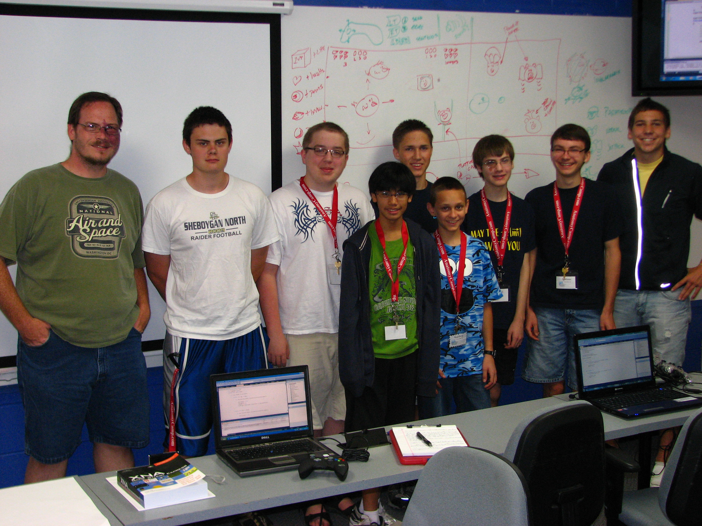
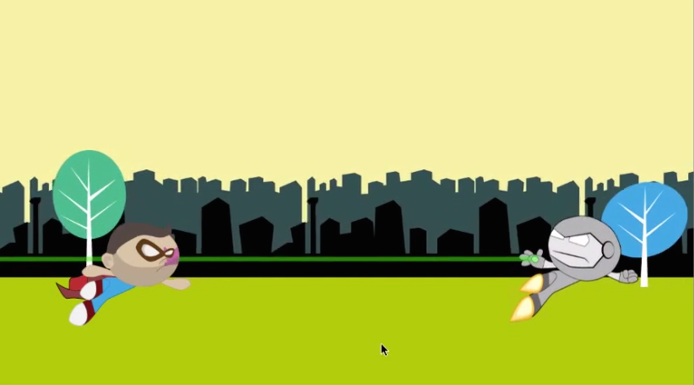

## Overview

 
_**The 2011 Campers**_

Landry Academy's Computer Camp 2011 had seven students, ages 13 to 17, most of whom had never touched a compiler before this class. It was a great bunch of kids!

They had a contagious passion that made the insane deadline (4 days from concept to demo) achievable. During almost every block of time that the camp had scheduled free-time for the kids, you'd find them in the classroom, hard at work on the project.

On the first day, we spent several hours installing the tools that we needed to create games. We had a brainstorming session that evening to plan what type of game we would build. The class was fairly evenly split between a scrolling shooter (like _Defender_ or _1942_) or an _Angry Birds_ clone. We ultimately decided on an original game that combined the two concepts.

Four birds (controlled by four players) fly along, shooting pigs with seeds and dropping eggs on them. There are three types of pigs: normal pigs (on the ground and in trees), pig-a-troopers (who parachute in), and the king pig (who tosses baby pigs at you).

The game's art is a mix of characters from the Angry Birds game, random images we found via Google searches, and some hills that were drawn the night before we gave our class presentation to the students from the other academic areas.

The students created all the in-game sound effects. I think the effects came out great, and I think they really add a lot to the final game. The music was downloaded from the website of a talented composer who recreated the Angry Birds theme in Garage Band.

 
_**The 2011 Camp's Game**_

The 2011 Camp's game can be downloaded from the following URL:

`http://camps.moreoncode.com/Camp2011/`

## Our Game

Our game will be a single-player side scroller featuring one of the lesser-known, ruggedly-handsome heroes, Super Joe! Super Joe will be battling robot enemies that look nothing like Iron Man&trade;. Oh, and Super Joe in no way resembles any of the Powerpuff Girls&trade;. Clearly. He has a cape, and he's a dude.

While **Chapter 4** introduced the concept of a scrolling background to give the illusion of movement through space. Our game will add layers of scrolling images to achieve an effect known as parallax scrolling. This will give the game depth. Images that are further from the player will appear to move slower than images that are closer to the player.

 
_**Our Game Concept**_

We won't start most of our games with such a polished concept drawing. Expect whiteboard notes from now on. This is a screenshot from a test app I created and deployed to my Android tablet ages ago.

Since the proof-of-concept, I've decided that the hero will shoot lasers at his enemies, and that his enemies will fire rockets at him. That will allow us to add effects like smoke trails and explosions.

Super Joe will score some number of points for each enemy that he defeats, and a smaller number of points for each rocket he's able to destroy before it reaches him. Contrary to popular belief, Super Joe is not invulnerable. When a rocket strikes him, he will take damage. When he takes enough damage, the game will be over.

## The Design

As with any project, we need to do a little planning before we start filling our disk with ones and zeros. Luckily, the mechanics of the endless runner genre are very well established.

### Controls

The controls are simple. We'll support touchscreens, controllers, and keyboards. Let's start with the touchscreen.

* **Running:** Don't worry about running, the hero handles that automatically -- by running as fast as they can, increasing their velocity until they reach their top speed.
* **Jumping:** Tap to jump. A quick tap for a short jump, a long press for the highest jump the hero can manage, or anything in between.
* **Sliding:** Swipe down to slide under an obstacle.

As for the devices with a gamepad, we can map jumping to one button (along with the short and long press behaviours) and sliding to another button. And since it won't hurt anything to give the player options, we can also map jump to thumbstick and DPad up, and slide to thumbstick and DPad down. In fact, via our keyboard-to-gamepad mapping, the player can use the up and down keyboard keys similarly.

### Obstacles

...

### Scoring

...

### Eye Candy

...

## The Code

Let's get started!

...

## Summary

Blah. Blah. Blah. Blah. Blah.

## Review Questions

Blah. Blah. Blah. Blah. Blah.

## Exercises

Blah. Blah. Blah. Blah. Blah.

