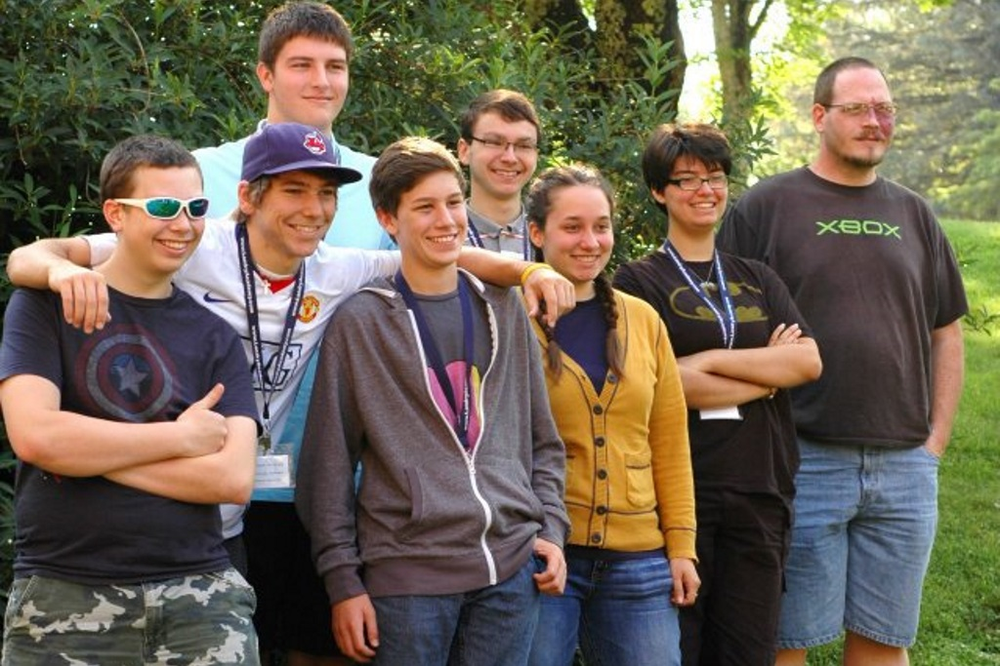
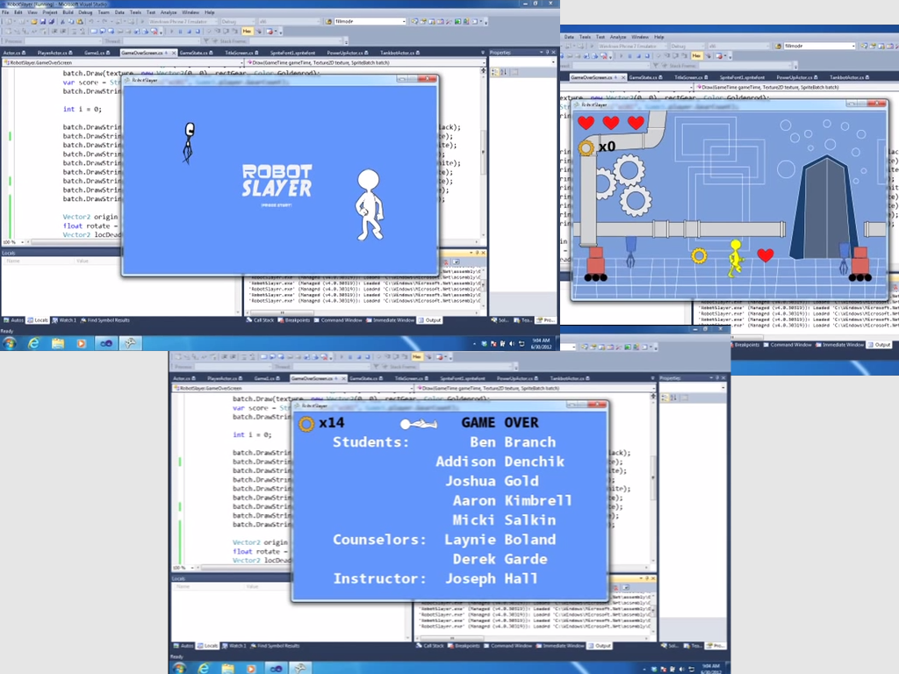
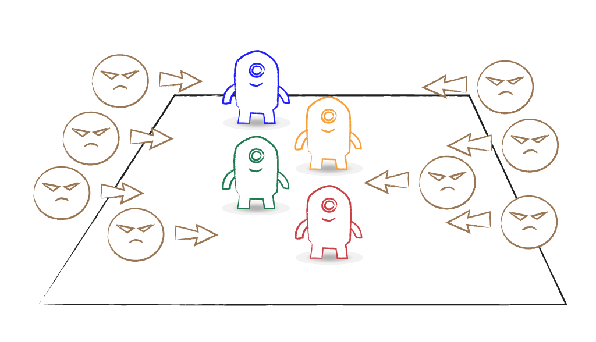

## Overview

 
_**The 2012 Campers**_

Landry Academy's Computer Camp 2012 had five students, ages 15 and 16, many of whom had never touched a compiler before this class.

On the first day, we spent several hours installing the tools that we needed to create games. We had a brainstorming session while we waited for the installers to do their magic, planning what type of game we would build. I was campaigning for a _Rock Band_ / _Guitar Hero_ style game, but the class decided to design a platformer game (ala _Super Mario Bros._).

A cartoony hero walks around a factory / lab complex jumping on the heads of killer robots to destroy them. There are two flavors of robot: the Hoverbot who quickly floats towards the player, and the Tankbot who moves a little slower, but fires missiles at the player at regular intervals. When a robot is destroyed, it drops a gear (likely) or a heart (less frequently). The player's score is the number of gears collected.

The game's art is a collection of doodles that I did in Adobe Illustrator, feverishly churning out assets each evening in an attempt to stay a step ahead of the class. The main character is the result of a tutorial that I followed over at idleworm.com.

The plan to make a platformer turned out to be too much work for a week-long project. We cut features, and ultimately decided to turn the project into a survival game.

 
_**The 2012 Camp's Game**_

The 2012 Camp's game can be downloaded from the following URL: 

`http://camps.moreoncode.com/Camp2012/`

## Our Game

I'll give you a break from my attempts at being a game artist. We'll use Kenney's assets to create a similar game. This new game will support one to four players. They will start off in the center of the screen and baddies will approach from each side.

The waves of baddies increase in frequency and size as the game goes on. Players fight off the hordes until each meets their inevitable doom. The last player standing wins the game.

I said "one to four players", didn't I? I guess you could play this one solo, but you'll always be the winner. I suppose you can play to see how long you last on your own, but at its core, this is meant to be a multiplayer game.

Oh, I almost forgot another important addition to this game. The players can move left and right, as you might expect, but also towards and away from the screen. Didn't see that one coming, did ya?

 
_**Our Game Concept**_

You're probably thinking that we will just use the Y component of each player's location to dictate their distance from the screen. And you're quite right. But players can also jump in this game, so we'll need to introduce a Z component to the players' locations.

To keep it all from becoming too confusing for the player, each avatar will have a shadow below it so that you can easily tell their position in the game world, even when they're jumping. The Z value will be combined with the Y value for the avatar when we draw them, but their shadow will ignore the Z component. The shadow simply shows the player's relative X and Y to the other players and the enemies.

## The Design

As with any project, we need to do a little planning before we start filling our disk with ones and zeros. Luckily, the mechanics of the endless runner genre are very well established.

### Controls

The controls are simple. We'll support touchscreens, controllers, and keyboards. Let's start with the touchscreen.

* **Running:** Don't worry about running, the hero handles that automatically -- by running as fast as they can, increasing their velocity until they reach their top speed.
* **Jumping:** Tap to jump. A quick tap for a short jump, a long press for the highest jump the hero can manage, or anything in between.
* **Sliding:** Swipe down to slide under an obstacle.

As for the devices with a gamepad, we can map jumping to one button (along with the short and long press behaviours) and sliding to another button. And since it won't hurt anything to give the player options, we can also map jump to thumbstick and DPad up, and slide to thumbstick and DPad down. In fact, via our keyboard-to-gamepad mapping, the player can use the up and down keyboard keys similarly.

### Obstacles

...

### Scoring

...

### Eye Candy

...

## The Code

Let's get started!

...

## Summary

Blah. Blah. Blah. Blah. Blah.

## Review Questions

Blah. Blah. Blah. Blah. Blah.

## Exercises

Blah. Blah. Blah. Blah. Blah.

