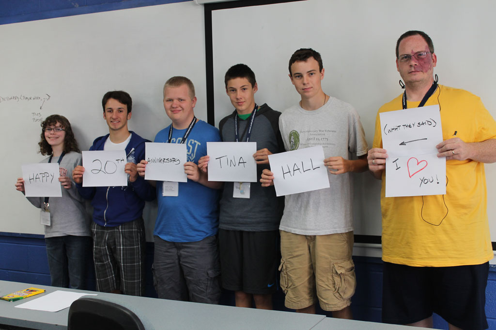
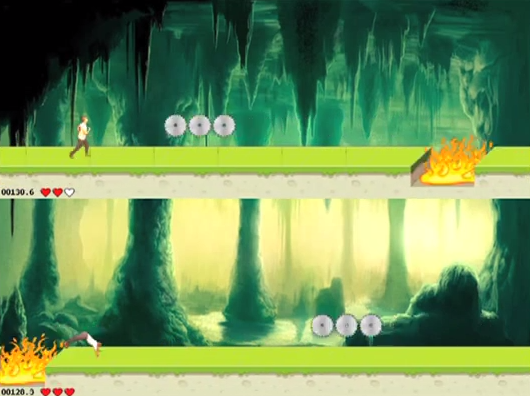
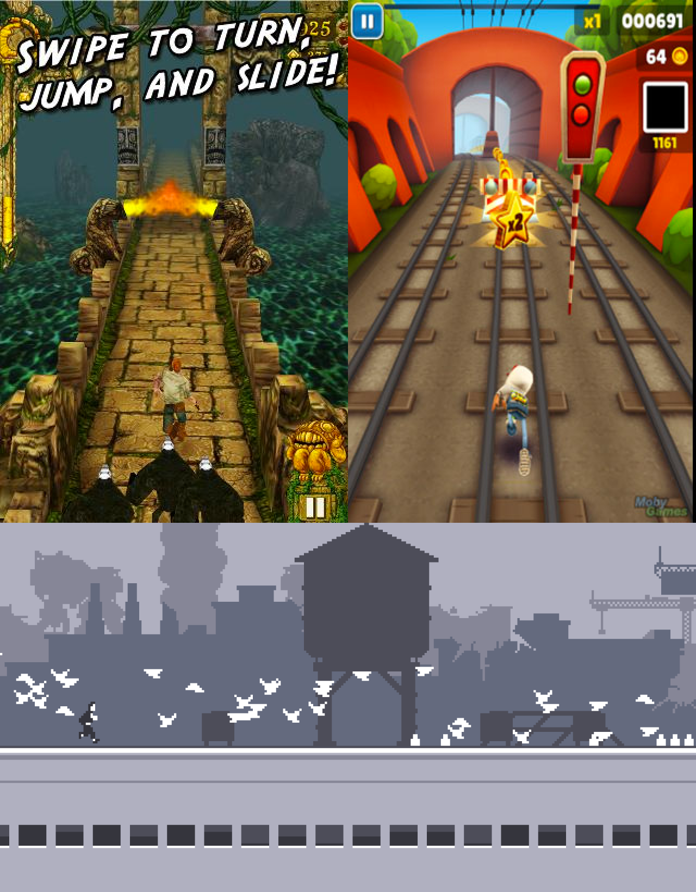
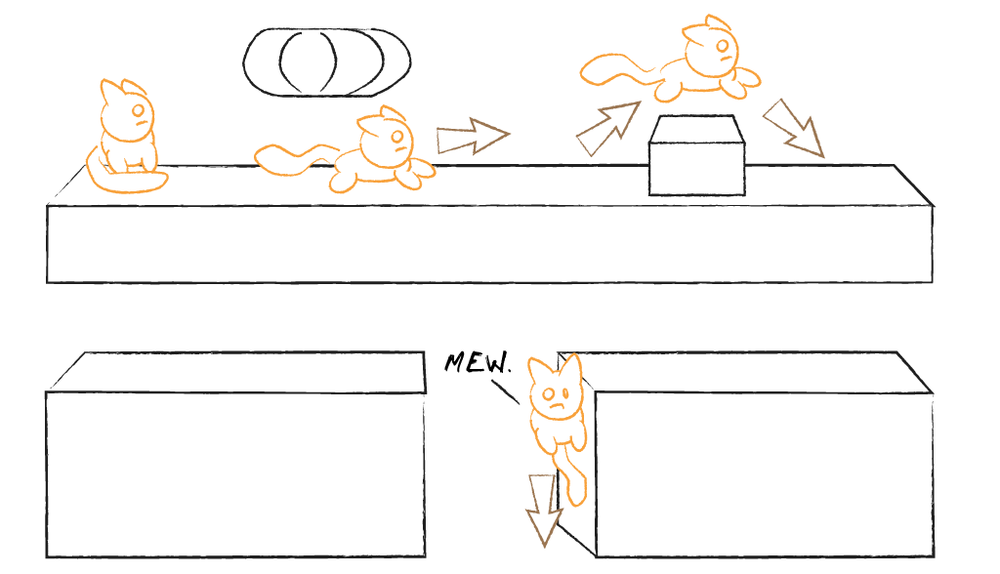

## Overview

 
_**The 2013 Campers**_

Landry Academy's Computer Camp 2013 had five students, none of whom had used a compiler before this class.

On the first day, I typically have a brainstorming session with the students while the tools are installing. With past classes, we compile a list of game genres that we might like to explore, come to a consensus on which to implement, then dive deeper into the details of the selected game.

This year, the students gravitated immediately to a concept based loosely on _Temple Run_. Rather than considering other genres, they kept tossing out ideas for the platformer-style game. It was obvious what our project would be early into the process. I keep campaigning for a _Rock Band_ clone, but it never seems to take hold of anyone's interest.

This year, in addition to art I created and images we scavenged from the web, we took video of one of the camp counselors in several poses, including a slow motion roll. The students cut the images from the still frames of the video, and the counselor (_hi, Tim!_) was our game's main character.

The game supports two players, each of which has to run an identical gauntlet of obstacles. The player that makes it the furthest distance before losing three health points is the winner.

The original design included power-ups and more elaborate obstacles. In the end, we realized that the full game would to be too much work for a week-long project. We cut features, but the end result was still a very nice game.

 
_**The 2013 Camp's Game**_

The 2013 Camp game can be downloaded from the following URL: 

`http://camps.moreoncode.com/Camp2013/`

## Our Game

The project from the 2013 camp was inspired by games like *Temple Run*, *Subway Surfers*, and *Minion Rush*. Those games are 3D, but our game was a 2D version that captured the spirit of the endless runner genre - run, jump, and slide until you die. The further you make it, the better your score.

At the time, I was unaware of another endless runner called *Canabalt*. It's a fast-paced, single-action 2D game where you jump from rooftop to rooftop, evading who knows what. Believe it or not, I actually came up with the concept for this chapter's game before I saw *Canabalt*. The design is so similar that it now feels like a clone, but it's not -- I pinkie promise.

 
_**Endless Runner Examples**_

The hero of our game, as with *Canabalt*, is running for their life from an unknown threat. Our hero, however, has twice as many legs! It's a cat that's on the run. You can plug in your own storyline. Maybe the little critter is fleeing an overzealous animal control officer. Maybe the cat is patient zero, freshly escaped from a viral lab. I don't know why it's running, I just know that this has the makings of a fun game.

> I created all the art for this example. Consider these assets to be in the public domain. Feel free to use (or ignore) them as you like.

Our hero will run (What choice do they have?), jumping from rooftop to rooftop. Some rooftops may contain obstacles that need to be evaded by jumping over them, or sliding under them. As the gameplay progresses, the cat will gain speed. If it smacks into an obstacle, its speed is reduced and momentum is lost. In time, though, the cat can reach full speed again, given enough error-free time on the run.

 
_**Our Game Concept**_

Unfortunately, the walls of buildings aren't as forgiving. If the player fails to clear the space between two buildings, they clumsily splat into the side of the upcoming building, slowly sliding down the wall in a formless clump of goo.

Don't worry, though. Our hero is a cat. And, as everyone knows, cats have nine lives! So, assuming that you haven't squandered the other eight lives in pursuit of a goal that isn't there, the only real penalty is that you're starting from a dead stop again. (Pun intended.) Momentum isn't just reduced -- it's zeroed out entirely. So, try to make it next time, OK?

## The Design

As with any project, we need to do a little planning before we start filling our disk with ones and zeros. Luckily, the mechanics of the endless runner genre are very well established.

### Controls

The controls are simple. We'll support touchscreens, controllers, and keyboards. Let's start with the touchscreen.

* **Running:** Don't worry about running, the hero handles that automatically -- by running as fast as they can, increasing their velocity until they reach their top speed.
* **Jumping:** Tap to jump. A quick tap for a short jump, a long press for the highest jump the hero can manage, or anything in between.
* **Sliding:** Swipe down to slide under an obstacle.

As for the devices with a gamepad, we can map jumping to one button (along with the short and long press behaviours) and sliding to another button. And since it won't hurt anything to give the player options, we can also map jump to thumbstick and DPad up, and slide to thumbstick and DPad down. In fact, via our keyboard-to-gamepad mapping, the player can use the up and down keyboard keys similarly.

### Obstacles

The obstacles come in two flavors -- three if you count splatting into an upcoming building -- jumping to avoid and sliding to avoid. If the player clears the object, momentum is maintained. If the player collides with the object, the object fades away and the player's current speed is reduced by some percentage. If the player smacks into a wall, their speed is reduced to zero and the character starts at the left edge of the rooftop that they didn't quite reach.

### Scoring

The player will receive points for every meter (an arbitrary measure of a single unit of distance in the game) they cover. The player's speed serves as a multiplier for the score. So, the longer they run at top speed, the more they are able to maximize their score.

### Eye Candy

Along the way, we will try to add some visual interest to the screen. This includes items that don't affect the gameplay, but add to the immersion of the game. For example, there may be birds on some rooftops who get spooked and fly away as the hero approaches. We can also add some city silhouettes in the background that move via parallax scrolling to give an illusion of depth to our flat world. We might go so far as to add lighting effects, but that may be a bit much for a single chapter.

> One bit of eye candy that *Canabalt* has which would be nice to add is collapsing buildings and low-flying aircraft that shake the screen when they are in view. I'm not sure if we will add that as part of this chapter, or present it as an exercise at the end. No cheating -- don't skip ahead to find out!
> (It's not quite as simple as it may seem. In effect, a collapsing building involves deforming the game world while the player is interacting with it. Obstacles have to shift position along with the falling rooftop and collision testing has to take the current state of collapse into account.)

## The Code

Let's get started!

...

## Summary

Blah. Blah. Blah. Blah. Blah.

## Review Questions

Blah. Blah. Blah. Blah. Blah.

## Exercises

Blah. Blah. Blah. Blah. Blah.

