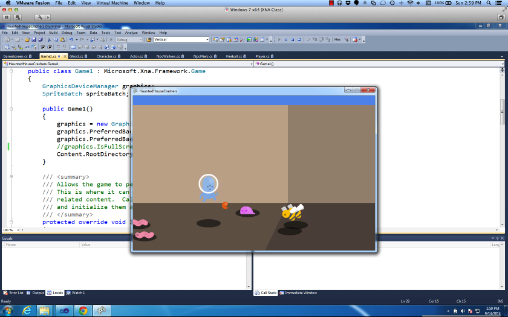
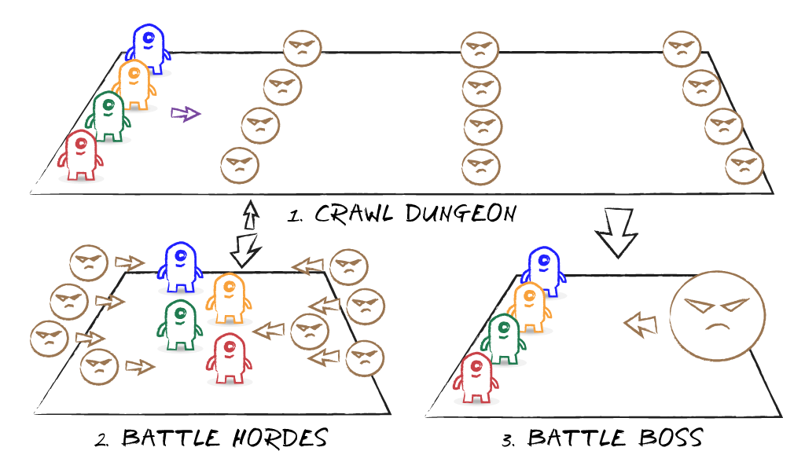

## Overview

 
_**The 2014 Campers**_

Landry Academy's Computer Camp 2014 had ten students - from CA, FL, GA, IL, LA, MD, PA, TX, and Mexico. Most had never touched a compiler before this class.

On the first day, we spent several hours installing the tools that we needed to create games. We had a brainstorming session during that time to plan what type of game we would build. The class zeroed in on a side-scrolling smash'em up, similar to _Castle Crashers_. The design supports one to four players.

The players are aliens who are spooked and run into a haunted house. The group works their way through the house, battling all sorts of baddies.

The game's art is a mix of characters and monsters from Kenney's assets.

Unfortunately, as is the case with such tight deadlines, so many features were trimmed from the game that it became less a castle crawler and more of a survival game. The players remain in the starting room as baddies keep coming to them. We also didn't have time to implement a boss screen, as originally planned.

There is no player select screen. The controller you're using dictates which character you play. And however many controllers are plugged in (one to four, as limited by XNA) dictates how many avatars appear in the game.

To balance the game for a varying number of players, a single player gets four hits before death, two players get three hits, three players get two hits, and if there are four players, each may only receive one hit before they are removed from the game.

The game's art is a selection of characters from Kenny's public domain assets.

 
_**The 2014 Camp's Game**_

The 2014 Camp game can be downloaded from the following URL:    

`http://camps.moreoncode.com/Camp2014/`

## Our Game

Now that we have more time, we'll build the game that the students wanted to build in the first place. The fact that we were able to trim some features and easily build a different game type should show you how similar a castle crawler and a survival game can be. In fact, a survival game is actually one component of a castle crawler.

 
_**Our Game Concept**_

The gameplay is fairly formulaic. Players move through the castle, killing baddies and collecting rewards. Every now and then, they're stopped in their tracks by a horde of enemies that attack from both sides. Once the invaders are defeated, the players continue their journey through the castle.

At the level's climax, the players encounter a new, more powerful enemy. This is the boss screen. There may be some minions that come to the aid of their leader, but the primary goal of this part of the game is to defeat the boss.

As you can see in the concept sketch, step two ("Battle Hordes") is a survival game, but with an achievable end. The baddies don't keep attacking forever. Even though it may feel that way in the heat of battle.

## The Design

As with any project, we need to do a little planning before we start filling our disk with ones and zeros. Luckily, the mechanics of the endless runner genre are very well established.

### Controls

The controls are simple. We'll support touchscreens, controllers, and keyboards. Let's start with the touchscreen.

* **Running:** Don't worry about running, the hero handles that automatically -- by running as fast as they can, increasing their velocity until they reach their top speed.
* **Jumping:** Tap to jump. A quick tap for a short jump, a long press for the highest jump the hero can manage, or anything in between.
* **Sliding:** Swipe down to slide under an obstacle.

As for the devices with a gamepad, we can map jumping to one button (along with the short and long press behaviours) and sliding to another button. And since it won't hurt anything to give the player options, we can also map jump to thumbstick and DPad up, and slide to thumbstick and DPad down. In fact, via our keyboard-to-gamepad mapping, the player can use the up and down keyboard keys similarly.

### Obstacles

...

### Scoring

...

### Eye Candy

...

## The Code

Let's get started!

...

## Summary

Blah. Blah. Blah. Blah. Blah.

## Review Questions

Blah. Blah. Blah. Blah. Blah.

## Exercises

Blah. Blah. Blah. Blah. Blah.

