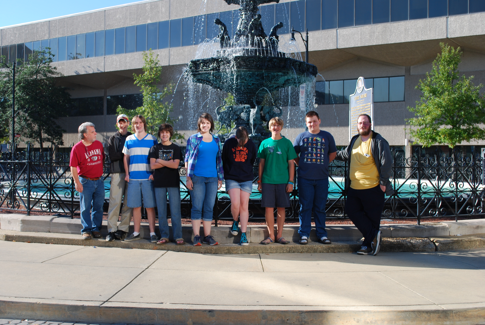
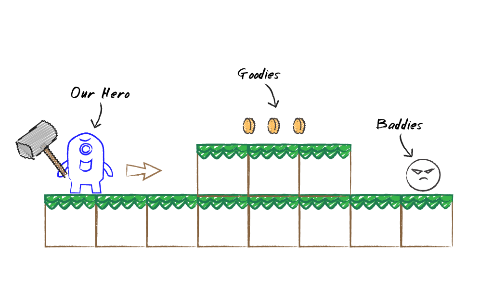

## Overview

In late 2012, I decided that I had put off working with my middle girl, Abby, too long. She showed an interest in programming at an early age, and she had progressed enough in her language and math skills that I felt it was time to get started. I came up with a plan that would force me to stick to a routine - I would include my coworkers' kids. With the structure of a class setting, and a regular schedule where others depended on me, I was sure to fulfill my fatherly duties. Right? ... Not so much.

The class was a group of 13 teens and tweens. Abby's in the middle of the bunch in that photo, staring at the ground. I'm the handsome devil with the manly beard on the right. This was the largest group of students that I had taught at the time. Best of all, it was my largest percentage of female developers. Including Abby, there were four girls. Sadly, much of the gang couldn't make it for the photo shoot.

I tried applying my camp format to the class, and it wound up being a really bad fit. Whereas the camp is a full, uninterrupted week of 5 - 6 hour days, the class met weekly for two hours, and I never set a deadline. Remember, my goal was to spend more time with the rugrat. I didn't have an exit strategy. The class met for almost a year before we called it quits. We never achieved our goal of making a platformer, but we did make several example games in our time together, and the students did learn a good bit about game programming.

## Postmortem

This group was full of ideas and features. A couple of students shanghaied the brainstorming process and steered the class into a platformer about a furry hero called, *Monkey Man 3000*. They had an incredible passion for the project, and put in the effort every week. Unfortunately, my inexperience with managing a group of that size led to an inefficient use of the short two hours we had together each week. Chatter consumed a good chunk of our time, but a couple of parents were always on site to help me wrangle the cats when needed.

Many months into the project, it was clear that Abby wasn't enjoying the class. She wanted to spend time with her dad - not compete with others, to have only a small fraction of his attention. I reluctantly let her drop out, but I wasn't about to just call it quits. The class continued for many more months before I announced the end of the experiment.

## From the Ashes

This chapter is dedicated to the students of my first class outside of the annual camps. I regret my inexperience, but value the opportunity it afforded me. The kids seemed happy, even though we hadn't reached our goal of a complete game (well, **the** complete game, *MM3K*), but I'll always see the endeavor as a failure on my part.

So, let's make a platformer!

## Our Game

Lorem ipsum dolor sit amet, consectetur adipiscing elit. Mauris sit amet fringilla augue. Integer justo lectus, fringilla sed tempus quis, accumsan ut mi. Duis ipsum quam, sodales ac fringilla at, gravida finibus ante. Fusce facilisis tellus et ultricies volutpat. Mauris eget tincidunt nulla. Vestibulum sodales nibh ipsum, nec euismod erat maximus id. Praesent posuere ultrices ultricies. Fusce bibendum vulputate mauris eu ultricies. Donec id laoreet ante, vel imperdiet dolor. Morbi suscipit lectus sit amet euismod imperdiet.

 
_**Our Game Concept**_

Nullam vulputate ipsum id maximus vulputate. Nullam tempor accumsan odio, ac accumsan tellus ultricies at. Nunc ex justo, egestas nec condimentum id, lobortis condimentum urna. Suspendisse potenti. Donec scelerisque leo quis felis facilisis bibendum. Etiam augue quam, varius nec enim dictum, imperdiet semper ex. Donec feugiat consectetur nulla, quis eleifend mauris vehicula ac. Duis pretium ac lacus vel gravida. Donec facilisis vestibulum venenatis. Donec odio arcu, rhoncus at semper vel, iaculis eu sapien.

## The Design

As with any project, we need to do a little planning before we start filling our disk with ones and zeros. Luckily, the mechanics of the endless runner genre are very well established.

### Controls

The controls are simple. We'll support touchscreens, controllers, and keyboards. Let's start with the touchscreen.

* **Running:** Don't worry about running, the hero handles that automatically -- by running as fast as they can, increasing their velocity until they reach their top speed.
* **Jumping:** Tap to jump. A quick tap for a short jump, a long press for the highest jump the hero can manage, or anything in between.
* **Sliding:** Swipe down to slide under an obstacle.

As for the devices with a gamepad, we can map jumping to one button (along with the short and long press behaviours) and sliding to another button. And since it won't hurt anything to give the player options, we can also map jump to thumbstick and DPad up, and slide to thumbstick and DPad down. In fact, via our keyboard-to-gamepad mapping, the player can use the up and down keyboard keys similarly.

### Obstacles

...

### Scoring

...

### Eye Candy

...

## The Code

Let's get started!

...

## Summary

Blah. Blah. Blah. Blah. Blah.

## Review Questions

Blah. Blah. Blah. Blah. Blah.

## Exercises

Blah. Blah. Blah. Blah. Blah.

