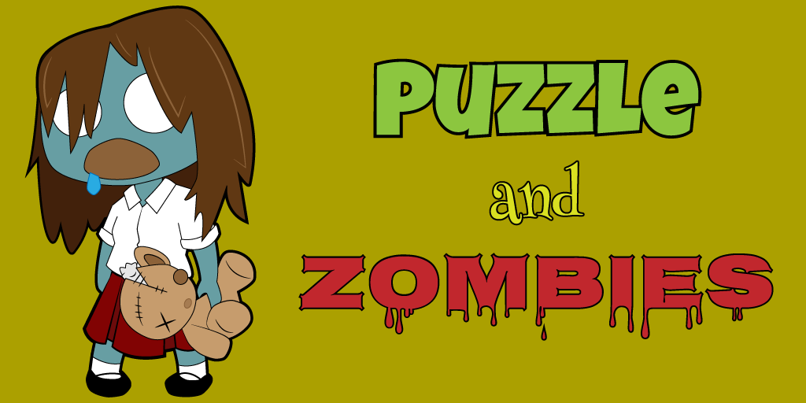

## Overview

Most game genres have a fairly narrow demographic to which they appeal. Typically, that demographic is young males. Puzzle games are one of those rare categories of games that cross gender and age barriers. Their simple, yet addictive game play seduces the casual gamer and the hard-core gamer alike. They even appeal to many people who wouldn’t consider themselves "gamers" at all. With a focus on problem solving, and having their roots in logic and math, puzzle games prove that simple games can be fun, even without a multi-million-dollar development budget or a big-name intellectual property license.

By far, the most popular title in this genre is *Tetris*, created by Russian mathematician Alexey Pajitnov (Pazhitnov) in 1985. *Tetris*, and the many clones and variants that it has inspired, has found its way onto nearly every platform imaginable. Most recently, puzzle games have found new life on smartphones, introducing many people who may otherwise never have been exposed to their addictive game play. And a new generation of puzzle games like *Bejeweled*, *Candy Crush Saga*, *Cut the Rope*, and *Flow* are doing their part to entice new players with this genre’s broad appeal.

In this chapter, you will learn how to:

* Simultaneously manage the state of multiple on-screen game objects
* Add simple, yet effective animations and visual effects to your game

## Our Game

If you had asked me what my favorite puzzle game was less than a year ago, I would have quickly replied, "*Tetris Attack*!" It's a simple, yet addictive little match-three game that pushes rows from the bottom. You clear pieces from the board by matching three or more tiles of the same color. The game's pace quickens as you play. If the pieces reach the top of the game board, the game is over. I loved this game so much that it was the featured example game for the puzzle genre in my 2007 book.

For the last several months, I've had a new favorite - *Puzzle and Dragons*. It's yet another match-three game with unique game mechanics (moving pieces has a huge influence on the game board) and an RPG element that makes this title more addicting than crack.

In this chapter we will develop a simplified clone of this game called *Puzzle and Zombies*. We'll capture the game play mechanics, but won't add in the RPG element.

 
_**Our Game's Title Screen**_

## The Design

Blah. Blah. Blah. 

### Controls

...

### Obstacles

...

### Scoring

...

### Eye Candy

...

## The Code

Let's get started!

...

## Summary

Blah. Blah. Blah. Blah. Blah.

## Review Questions

Blah. Blah. Blah. Blah. Blah.

## Exercises

Blah. Blah. Blah. Blah. Blah.

