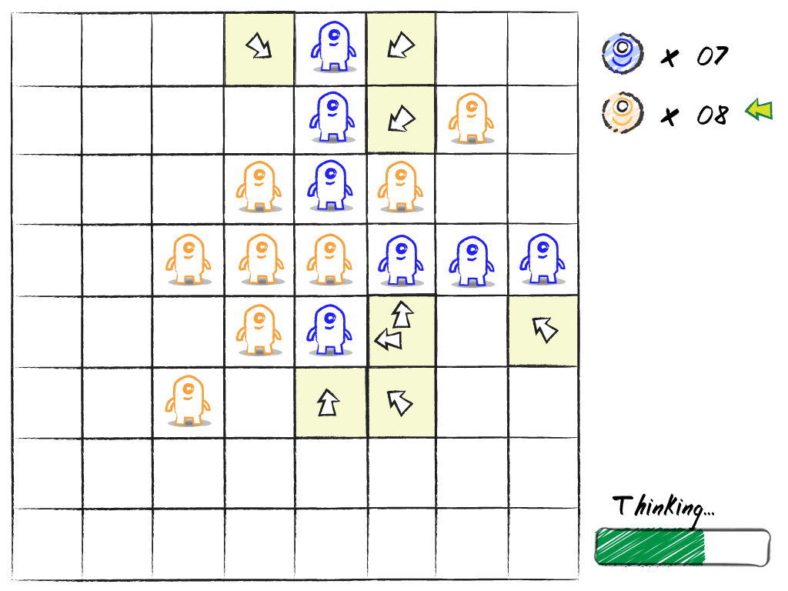

## Overview

Board games are another of those categories of games that have mass appeal, and many of the most popular board games have been around so long that copyright issues are no longer a concern, so they can be a great source of inspiration for your original titles.

In this chapter, you will learn how to:

* Implement simple computer opponents to enhance single-player game play
* Simultaneously manage the state of multiple on-screen game objects
* Add simple, yet effective animations and visual effects to your game
* Use threading to keep animations going while processing background tasks 
* Track and display a player’s score using a bitmap font

## Our Game

In this chapter, we will develop a simple version of a popular board game that originated in England around 1880. Reversi gained wide-spread popularity in England towards the end of the 19th century, and it experienced a resurgence in popularity in the 1970s, when it was refined into its modern incarnation and banded with a new moniker - Othello.

In our version of the game, the action takes place on a 8-by-8 grid. Each player starts with two pieces, placed in the center of the grid. One point is awarded for each piece a player has on the grid. Players must place their piece on the board according to the following rules:

* The grid cell into which the piece is placed must be empty.
* The grid cell into which the piece is placed must be adjacent to one of the opponent’s pieces.
* The player’s new piece, along with an existing piece, must "surround" at least one piece of the opponent, in a straight line (horizontally, vertically, or diagonally).

Players take turns placing pieces on the board in an attempt to capture their opponent’s pieces and maximize the number of grid cells that are occupied by their own pieces. When there is no legal move for a player, he forfeits his turn and play passes to his opponent. If neither player can make a legal move (as is the case when the grid is full), the game is over. The player with the most pieces on the board wins.

 
_**Our Game Concept**_

## The Design

The basic design for this game is fairly simple. The game grid starts out empty and is gradually filled, one piece at a time. As pieces are added to the grid, we need to make sure that the additions satisfy the game rules. The basic components to handle these tasks are detailed in the following text.

### The GameBoard

The `GameBoard` class contains a two-dimensional array of GamePiece objects. The dimensions of this array are determined by the `GridWidth` and `GridHeight` member variables. The `GameBoard` class is also responsible for making sure that any moves that are made by a player (human or CPU) conform to the rules of the game. This is done by determining the complete list of valid moves (stored in the `ValidMoves` array) whenever a game turn begins. Only moves in this list are allowed.

### Determining Valid Moves

The `UpdateListOfValidMoves` method creates a list of all the grid cell locations where the current player may legally place his new game piece. New pieces may only be placed on the game board if they meet the three requirements of the game rules: the cell is empty, the cell is adjacent to an opponent’s piece, and the new piece (along with an existing piece) will surround at least one of the opponent’s pieces.

### Scoring

...

### Eye Candy

...

## The Code

Let's get started!

...

## Summary

Blah. Blah. Blah. Blah. Blah.

## Review Questions

Blah. Blah. Blah. Blah. Blah.

## Exercises

Blah. Blah. Blah. Blah. Blah.