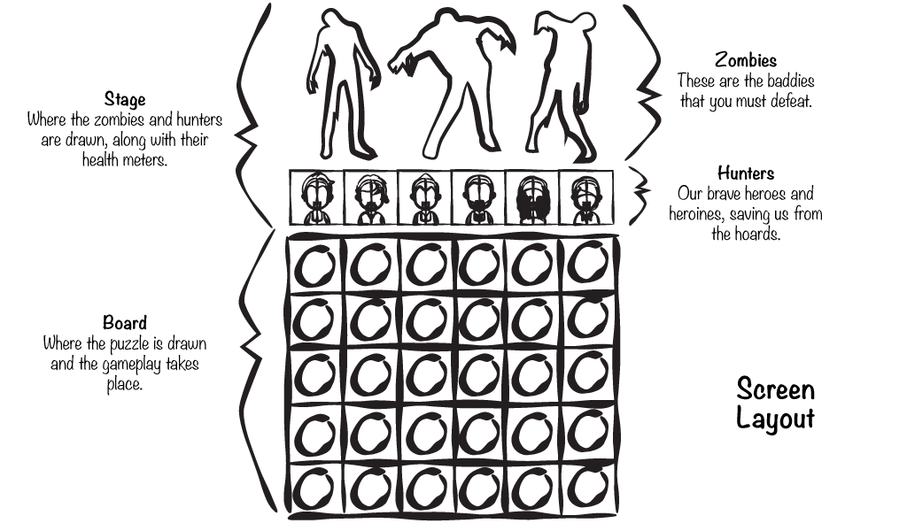
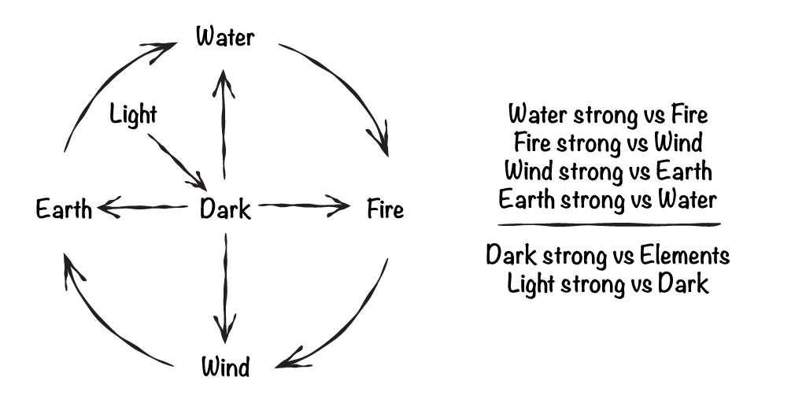

# Overview

I'm a huge fan of puzzle games. In that genre, GungHo's Puzzle and Dragons (PaD) has occupied more of my free time than I care to admit. PaD combines simple match-three game mechanics with several RPG elements to create a game that's more addictive than nicotine.

PaD is free to play, but offers items for purchase in the game. The average player spends just under $12. This model has worked very well for GungHo. PaD has the distinction of being the first mobile game to exceed one billion dollars in revenue!

We won't reproduce every aspect of this game, but I hope to capture the essence of what makes this game so much fun to play.

In this chapter we will:

> - Design our game
> - Blah ...

{pagebreak}

# Our Game

Rather than dragons, we will battle zombies. The player is presented with enemies that they defeat by matching colored orbs. When orbs are matched, the zombie hunter of the same attribute is activated, and they attack the oncoming horde.

 
_**The Components of our Game Screen**_

As zombies are defeated, the player collects experience and coins. The coins are used to buy supplies for the next hunt. Experience is used to level up the hunters, making them more powerful. You will need more powerful hunters as the game progresses because the zombies become harder and harder to defeat.

## Match Three

With each turn, the player selects an orb to drag across the board. As the orb is dragged from cell to cell, the other orbs fall into the wake left behind. This allows the player to deform the board, manipulating the location of any orb by pushing it out of the way with the orb being dragged.

Match three or more orbs horizontally or vertically to clear them. Each cleared orb adds to the attack that the hunters will make. The more orbs you match at once, the more damage your hunters will cause. It's a simple formula that's easy to learn and hard to master.

## Rock, Paper, Scissors

The game is blanced using the same rules that drive many real-time strategy games - a variant of rock, paper, scissors. Our rules of attack and defense are based on the elements - earth, water, fire, and wind, plus the light and dark mystical elements.

 
_**The Elements**_

{pagebreak}

# Summary

Blah.

## Review Questions

Think about what you’ve read in this chapter to answer the following questions.

1.	Blah.
1.	Blah.
1.	Blah.

## Exercises

**EXERCISE 1.** Blah.

**EXERCISE 2.** Blah.