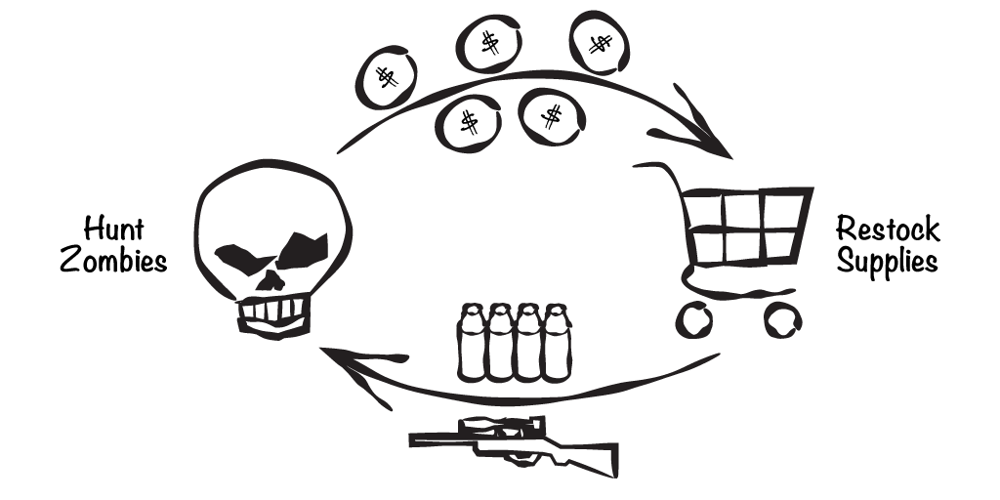
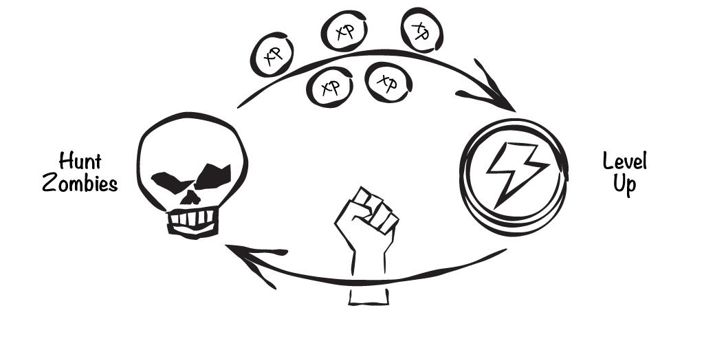
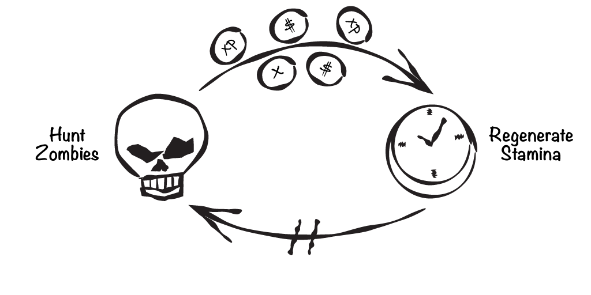

# Overview

Blah.

- add
  - inventory, 
  - stamina, and 
  - leveling up (for player and monster)

 
_**Hunt for Coins, Buy Supplies**_

Blah.

 
_**Hunt for Experience, Level Up**_

Blah.

 
_**Regenerate Stamina, Hunt Zombies**_

{pagebreak}

# Summary

Blah.

## Review Questions

Think about what you’ve read in this chapter to answer the following questions.

1.	Blah.
1.	Blah.
1.	Blah.

## Exercises

**EXERCISE 1.** Blah.

**EXERCISE 2.** Blah.