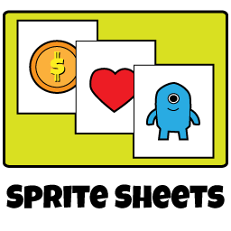
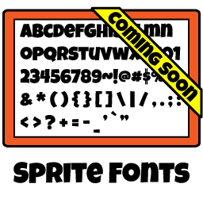
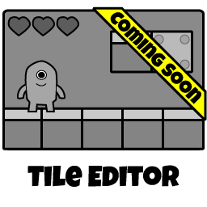
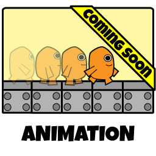
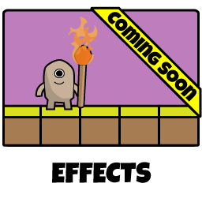

GameDevUtils.com is a suite of tools that I developed for my game programming students. There are certainly 
better products out there, but I wanted my students to have access to free tools and, more importantly, 
access to the source code for those tools. I also didn't want the tools to look like poop that was 
designed in the 80's.

<table border="0" cellpadding="0" cellspacing="0" style="width:600px; margin-left: auto; margin-right: auto;">
	<tr>
		<td style="width:300px;">
			
		</td>
		<td style="text-align:center; white-space:nowrap;">
			
A tool to merge several art assets (objects  
			   within the game) into a single image, saving  
			   memory and reducing CPU-to-GPU chatter.
			

			
<a href="#popupFeatureSheets" role="button" data-toggle="modal" class="btn btn-primary">Show Features</a> <a href="{{ site.baseurl }}/webapps/sheets/" class="btn btn-primary">Go!</a>

		</td>
	</tr><tr>
		<td style="width:300px;">
			
		</td>
		<td style="text-align:center; white-space:nowrap;">
			
A tool to convert public domain TTF &amp; OTF  
			   fonts into bitmap fonts - a format that is  
			   more easily consumed by game engines.
			

			
<a href="#popupFeatureFonts" role="button" data-toggle="modal" class="btn btn-primary">Show Features</a> <a href="{{ site.baseurl }}/webapps/fonts/" class="btn btn-primary">Go!</a>

		</td>
	</tr><tr>
		<td style="width:300px;">
			
		</td>
		<td style="text-align:center; white-space:nowrap;">
			
A tool that manages the placement of a fixed  
			   set of tiled images. By painting these tiles  
			   into place, entire game worlds can be made.
			

			
<a id="cmdShowFeaturesTileEditor" href="#null" class="btn btn-default disabled">Show Features</a> <a href="{{ site.baseurl }}/webapps/tiles/" class="btn btn-default disabled">Go!</a>

		</td>
	</tr><tr>
		<td style="width:300px;">
			
		</td>
		<td style="text-align:center; white-space:nowrap;">
			
A tool to assemble sprites into frame-based  
			   or bones-based animation sequences.  
			   Future version to include UV deformation.
			

			
<a id="cmdShowFeaturesTileEditor" href="#null" class="btn btn-default disabled">Show Features</a> <a href="{{ site.baseurl }}/webapps/bones/" class="btn btn-default disabled">Go!</a>

		</td>
	</tr><tr>
		<td style="width:300px;">
			
		</td>
		<td style="text-align:center; white-space:nowrap;">
			
A tool to create visual effects as parametrized  
			   animations that can be placed in the game world  
			   and have their playback tweaked at run-time.
			

			
<a id="cmdShowFeaturesTileEditor" href="#null" class="btn btn-default disabled">Show Features</a> <a href="{{ site.baseurl }}/webapps/effects/" class="btn btn-default disabled">Go!</a>

		</td>
	</tr>
</table>

## What Makes GameDevUtils.com So Special?

It's certainly not its features. The commercial offerings provide options and functionality that 
aren't (yet) supported in this suite of tools. The biggest benefits of this suite are that it's 
open source, and that it doesn't require you to install anything. Everything runs in your browser.

<h3>Everything Runs in Your Browser</h3>

You read that right. Everything runs in your browser. The technology that drives GameDevUtils.com is 
vanilla HTML5 and JavaScript. That means that you can use the app from any operating system, 
using any modern web browser.

You don't have to be an administrator on your computer. You don't have to worry about updates.

At least, that's the idea. I've been developing on my MacBook Pro, using Google's Chrome web 
browser. I'll be doing more extensive testing in the near future.

<h3>Your Assets, on Your Computer</h3>

There is no server component to GameDevUtils.com. Assets are loaded into your browser from your local
file system. Project files are loaded from and saved to your computer. Published resources are
generated on and saved to your computer.

Your data is never transmitted to the server. I don't need to see it, and I don't need to pay
for dedicated servers that churn through data or bandwidth for that data to travel to and from 
those servers.

In fact, if you really want to be cautious (*cough* *cough* tinfoil hat *cough*), you
can download the static HTML and Javascript and run them on your computer - even without an
internet connection.

<h3>Stop, Collaborate, and Listen! (Share Your Work)</h3>

Project files and published resources are generated as self-contained plaintext or compressed 
(ZIP DEFLATE) files. Just share the file via email, DropBox, or however you normally 
share files with teammates.

Resources are embedded in the project file, not linked. GameDevUtils.com embeds the source image 
data and configured options. Once assets have been added to the project, they're never 
referenced from your filesystem again. Share away.

<h3>FUTURE: Prefer a Command Line Interface?</h3>

One of the selling points of the commercial offerings is that they provide a command line interface for their tools. Today, GameDevUtils.com is a browser-based suite of tools.

I have plans to refactor the logic that drives the web apps into [NodeJS](https://nodejs.org/) modules, and share that code between the web and console versions of the tools.

Why all the effort? I want to support build pipelines. Just plug some scripts into your favorite continuous integration solution and build your assets alongside your code!

<h3>FUTURE: Want to Work in the Cloud?</h3>

The beauty of GameDevUtils.com is that there are no dependencies on the client. It's OS and, to a great extent, browser independent. Also nice is that your data need never leave your computer. That is, until you want to work with a team. If you think emailing ZIP files is clunky (I certainly do), then there's a new option coming your way soon!

You're probably already using one of the many popular cloud storage providers. If so, you can tell GameDevUtils.com to reference assets as file links rather than embedding those resources in the project files. That makes the project files smaller, and it makes it easier to edit an asset without having to remove it from the project and add it back.

<ul>
  <li>Google Drive</li>
  <li>Dropbox</li>
  <li>OneDrive</li>
  <li>iCloud</li>
  <li>GitHub</li>
  <li>Bitbucket</li>
</ul>

I know what you're thinking ... *Hey! GitHub and Bitbucket aren't cloud storage providers!*

You're absolutely right. But, after the cloud storage support is in place, I hope to provide GitHub and BitBucket integration for the ultimate in team collaboration.

## Want to Help?

Kick the tires. Try things out. If you find something wonky, or just want to suggest a new feature, [open an issue](https://github.com/groundh0g/gamedevutils.com/issues).

If you're looking to contribute, I ask that you keep edits small and as self-contained as possible. The planned support for a command line interface will involve a lot of churn in the code.

Simple bug fixes are another story, though. Issue your pull request against the [gh-pages branch](https://github.com/groundh0g/gamedevutils.com/tree/gh-pages) for now. Once the code has been modularized for web and console, it should live in the master branch.

------
Thanks for Visiting! 
&mdash; [@groundh0g](https://twitter.com/groundh0g)

  

	

	  

		<button type="button" class="close" data-dismiss="modal" aria-label="Close">&times;</button>
		<h4 class="modal-title">Sprite Sheet Features</h4>
	  

	  

		<h3>Current Features:</h3>
		

			<i class="fa fa-check"></i> Import web-friendly image formats 
			<i class="fa fa-check"></i> <em>Extract animated GIF frames!</em> 
			<i class="fa fa-check"></i> Export images as PNG, GIF, or JPG 
			<i class="fa fa-check"></i> Export data as XML or JSON 
			<i class="fa fa-check"></i> Export data as CSS 
			<i class="fa fa-check"></i> Trim &amp; crop unused pixels 
			<i class="fa fa-check"></i> Heuristic mapping (chroma key) 
			<i class="fa fa-check"></i> Basic rects (shelf) texture packing 
			<i class="fa fa-check"></i> MaxRects texture packing 
			<i class="fa fa-check"></i> Alpha (transparent) cleaning (aids compression) 
			<i class="fa fa-check"></i> Debug mode (show sprite outlines)
		

		<h3>Planned Features:</h3>
		

			<i class="fa fa-wrench"></i> Import non-web image formats 
			<i class="fa fa-wrench"></i> Export optimized images 
			<i class="fa fa-wrench"></i> Allow sprite rotate within sheet 
			<i class="fa fa-wrench"></i> Alias duplicate sprites 
			<i class="fa fa-wrench"></i> DropBox (et. al.) support
		

	  

	  

		<button type="button" class="btn btn-primary" data-dismiss="modal">Dismiss</button>
	  

	

  

  

	

	  

		<button type="button" class="close" data-dismiss="modal" aria-label="Close">&times;</button>
		<h4 class="modal-title">Sprite Fonts Features</h4>
	  

	  

		<h3>Current Features:</h3>
		

			<i class="fa fa-check"></i> Select from a library of 2000+ fonts 
			<i class="fa fa-check"></i> Export images as PNG, GIF, or JPG 
			<i class="fa fa-check"></i> Export data as XML or JSON 
			<i class="fa fa-check"></i> Trim &amp; crop unused pixels (smaller files) 
			<i class="fa fa-check"></i> Kerning (deduced) 
			<i class="fa fa-check"></i> Metrics (deduced) 
			<i class="fa fa-check"></i> Specify included characters 
			<i class="fa fa-check"></i> Filter included characters from sample text 
			<i class="fa fa-check"></i> Debug mode (show font metrics as outlines)
		

		<h3>Planned Features:</h3>
		

			<i class="fa fa-wrench"></i> Import your own TTF/OTF fonts 
			<i class="fa fa-wrench"></i> Kerning (inspect font data) 
			<i class="fa fa-wrench"></i> Metrics (inspect font data) 
			<i class="fa fa-wrench"></i> Embedded bounds data in image (no separate atlas) 
			<i class="fa fa-wrench"></i> Export optimized images 
			<i class="fa fa-wrench"></i> Alias duplicate glyphs 
			<i class="fa fa-wrench"></i> DropBox support
		

	  

	  

		<button type="button" class="btn btn-primary" data-dismiss="modal">Dismiss</button>
	  

	

  

